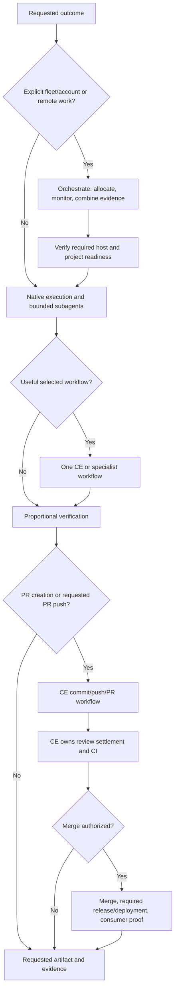

# Native work, selected workflows, and fleet orchestration

Routine work uses the harness's native tools and bounded subagents. Railyard
adds deliberate model and reasoning-effort allocation and selects a useful
Compound Engineering workflow when the request benefits from one. A configured
fleet catalog does not turn an ordinary local edit into fleet work.

## Choose the smallest useful path

| Situation | Path | Completion boundary |
| --- | --- | --- |
| Known edit, bounded implementation, or routine investigation | Native tools; delegate independent subtasks when useful | The requested result and proportional checks |
| Planning, debugging, review, or UI work that benefits from a focused workflow | Select the matching CE or specialist skill automatically | The requested artifact or verified behavior |
| Create a PR or push user-requested commits to an existing PR | `compound-engineering:ce-commit-push-pr` | The requested PR state, with the selected CE workflow owning follow-through |
| Address PR feedback or watch CI | Applicable CE feedback or babysitting workflow | One owner for review settlement, CI, and the watch loop |
| Explicit Deliver implementation/fix or authorized ship request | Native or selected CE implementation, then CE settlement | Merge, required release or deployment, and consumer verification |
| Explicit fleet/account allocation, remote work, or coordination that needs `orchestrate` | `railyard:orchestrate` | Combined acceptance evidence from the selected lanes |
| Fleet setup or reconciliation | `roundhouse:fleet-readiness` | Required host, project, tool, and authentication readiness |

`deliver` coordinates one requested outcome. It may execute directly or select
a focused CE workflow; it does not send generic implementation through LFG by
default. LFG remains available when explicitly chosen. Plan-only, diagnosis-only,
review-only, local-only, and PR-only requests retain their stated endpoints.
An explicit Deliver implementation/fix request authorizes the full lifecycle,
including commit, push, PR, merge, required release or deployment, and consumer
verification. Internal skill selection does not expand a narrower user request.
Existing authorization carries through child handoffs and waits to completion.

## Choose model and effort together

For each assignment, deliberately choose both the model and reasoning effort.
Astra Max (`gpt-6-astra`, `max`) is the baseline candidate for substantive
engineering. Deterministic tools handle mechanical operations directly.
Another model or lower effort is appropriate when comparable completed work
supports the tradeoff, a specialty calls for it, or the user prioritizes
latency. Per-token prices alone do not establish cost per successful task.

Explicit inheritance is valid when the parent's model and effort suit the
assignment. For a native full-history child, use the supported inheritance
path and state the reason. When changing model or effort, use a supported
limited-history or no-history fork with enough context to execute the task.
Fixed specialist roles use their authoritative settings without forbidden
overrides. Never silently substitute an unavailable selection.

The narrow dispatch gate checks the supported allocation controls. A policy
decision, offline test, or catalog entry does not prove a live adapter is
available. Actual model, effort, and transport evidence remain separate from
the request; unknown observations stay unknown.

## Keep one workflow owner

When CE is selected, it owns its planning or implementation workflow and its
review, feedback-resolution, CI, and watch loop. Railyard carries the user's
requested endpoint and verifies the returned evidence. It does not add another
watcher, force a cross-model review, or insert a parallel Claude runner.

Thermos, Oracle, deeper review, browser checks, and debugging skills remain
available when their perspective is useful. Required repository checks stay
authoritative. Run focused checks for the changed behavior and repeat them
when a relevant change, failure, or unresolved concern justifies it.

Use `gh-stack` for related dependent PRs when useful; keep independent PRs
independent. Resolve missing tooling at the stage that needs it through its
supported manager. Startup does not bootstrap CE, Ponytail, or Superpowers.

## Native children and visible tasks

Native subagents are the default for independent bounded work inside the
current task. Give each mutable scope one writer and a clear validation
boundary; serialize shared-file integration and dependent changes. A task can
use several subagents without creating an orchestration framework.

Visible Codex tasks are user-owned. Create one only when the user explicitly
asks for a new task. Fleet or remote work must use a supported, authorized
placement surface; do not infer permission to create a visible task from the
presence of a saved project or fleet catalog. If the necessary placement
surface is unavailable, report that limitation without silently changing
provider, model, account, or host. SSH command execution alone is not a remote
agent.

Use clear task titles that follow the user's and repository's conventions.
Rename only when the material focus or resume state changes. Completion does
not imply authority to archive tasks, remove worktrees, or reap processes.
Keep cleanup available for an actual runtime problem or an authorized lifecycle
operation; preserve unrelated or resumed work.

## Explicit fleet and account work

`orchestrate` owns allocation, placement, monitoring, dependencies, and combined
acceptance evidence when that coordination is needed. It uses Roundhouse to
verify the required project, saved-project capability, harness, plugins, and
authentication before remote dispatch. A checkout on disk alone does not prove
the destination can accept the task.

Roundhouse owns fleet inventory and reconciliation. Missing required readiness
becomes a prerequisite; it does not authorize silent installation or unrelated
machine changes. Cross-project work names an integration owner for each project
and keeps branch and working-tree ownership explicit.

Provider-safe handoffs preserve privacy and transport boundaries. A matching
model-provider label does not prove that two collaboration surfaces can decrypt
the same payload. Use only an attested adapter, and retain the required handoff
acknowledgement before starting mutable work. A visible provider task still
requires the user's explicit task-creation request.

## Optional policy, accounting, and audit

`railyard/model-routing/v1` remains the single configured policy for model,
effort, account, privacy, budget, and transport controls. The normal native path
does not require a stateful admission ledger, carrier receipt, delivery
contract, or retrospective artifact.

For configured accounting, the existing `resolve`, `admit`, `claim-dispatch`,
and `reconcile` operations retain their constraints. A one-way claim does not
authorize a retry spawn; reconciliation needs the adapter's identity-bound
receipt. Unknown costs are not zero, unlike meters remain separate, and
`strict` limits require an adapter that can enforce the exact meter. Catalog
data cannot create a callable adapter or a trust-domain bridge.

Keep user configuration outside repositories and plugin caches. An explicit
`RAILYARD_MODEL_POLICY_PATH` selects that catalog exactly; missing or invalid
selected policy does not silently fall back. The configured fleet, Claude,
GLM, and Oracle lanes remain advanced capabilities subject to current host
evidence, not inferred live availability.

Use `audit` or a retrospective when requested or when a concrete lesson makes
it worthwhile. Compare complete assignments, including children, retries,
repairs, verification, time, and available usage data. Do not claim an Astra
cost advantage without comparable successful outcomes. Optional local learning
cannot change privacy, expand authority, or rewrite the user's policy.

## Source skills

- [`deliver`](../plugins/railyard/skills/deliver/SKILL.md)
- [`model-routing`](../plugins/railyard/skills/model-routing/SKILL.md)
- [`orchestrate`](../plugins/railyard/skills/orchestrate/SKILL.md)
- [`audit`](../plugins/railyard/skills/audit/SKILL.md)
- [`cleanup-codex`](../plugins/railyard/skills/cleanup-codex/SKILL.md)
