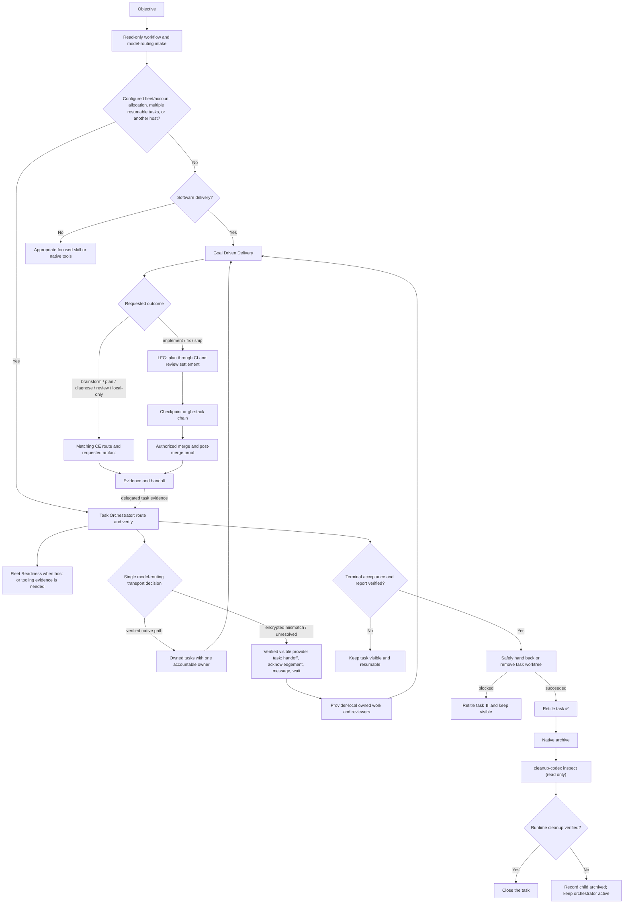

# Model Routing, Task Orchestrator, Goal Driven Delivery, and Fleet Readiness

The workflow has four distinct responsibilities:

- `model-routing` is the single versioned policy entrypoint for model, effort,
  budget, adapter, and transport decisions. It never starts carrier work.

- `task-orchestrator` owns an objective that requires multiple independently
  resumable tasks or remote task placement. It routes and monitors work but
  does not execute child tasks.
- `goal-driven-delivery` routes and executes one host-local change or pull
  request through the appropriate CE route. Generic implementation and bug
  fixes enter LFG by default and continue through merge and post-merge proof.
- Fleet Readiness is the Machine Utilities capability that verifies and, with
  approval, reconciles projects, agents, plugins, skills, authentication, and
  host availability. It does not own the objective or its implementation.

`orchestrate` is not a third workflow. Its useful delegation rules are now in
`task-orchestrator`, so keeping it would add another name without adding a
distinct responsibility.

## One task or several?

`task-orchestrator` is scoped to an objective, not to a project or machine. It
is used when configured fleet/account policy owns allocation, for two or more
independently resumable tasks, or when a task must be placed on another host.
Configured policy may fast-path a single lane. Explicit local/no-fleet and the
no-config single-host path enter Goal Driven Delivery directly. One bounded
task may still use several local subagents without becoming orchestration.

Software-delivery children use `goal-driven-delivery`. Research, operations,
review, documentation, and decision children use the appropriate skill for
their own outcome. A child invokes `task-orchestrator` only when its assignment
itself contains multiple independently resumable tasks; this prevents recursive
orchestration loops.

For cross-project delivery, each project gets an explicit integration and
repository-baseline owner. Each mutable software-delivery task gets one canonical
writer and its own branch or PR, validation boundary, and handoff; shared
integration files stay in one named task. The orchestrator records dependencies
between projects and verifies their evidence. It does not blur ownership or
combine working trees.

## Which skill should I use?

| Situation | Use | What happens |
| --- | --- | --- |
| Configured fleet/account delivery, including one-lane placement | `task-orchestrator` | It resolves project policy and may fast-path one Goal Driven Delivery lane. |
| Brainstorm, plan, diagnosis, review, or local-only request | `goal-driven-delivery` | It selects the matching CE route and stops at the requested artifact. |
| One feature, bug fix, refactor, or ship request on the current host | `goal-driven-delivery` | It routes generic implementation to LFG, then owns authorized merge and post-merge proof. |
| Existing PR to fix, drive, or deliver | `goal-driven-delivery` | It runs the applicable CE review or babysitting route, then owns authorized merge and post-merge proof. Review-only or watch-only requests stop earlier. |
| Two or more independently resumable tasks, in one project or several | `task-orchestrator` | It creates owned tasks, selects their execution skills, tracks dependencies, and verifies the combined result. |
| Work must run on another machine | `task-orchestrator` | It verifies that host, places a visible task there, and lets that task use host-local subagents and `goal-driven-delivery`. |
| Fleet setup or reconciliation | Fleet Readiness (Machine Utilities) | It inventories and, with separate approval, reconciles projects, agents, plugins, skills, authentication, and host availability. |
| A tiny known-file or documentation edit | Direct edit and targeted check | Neither delivery skill is required unless durable tracking or remote placement adds value. |

You normally invoke one workflow skill. Both delivery skills run the same
read-only `yardmaster:model-routing` intake. For an explicit local or
no-config single software-delivery task, invoke
`goal-driven-delivery`; it routes brainstorm, plan, diagnosis, review, and
local-only requests to their narrower CE terminal state and generic
implementation to LFG. For multiple independently resumable tasks or cross-host work, invoke
`task-orchestrator`; the orchestrator propagates that policy and decides which
workers should invoke `goal-driven-delivery`.

## How they fit together



The separation is intentional. An orchestrator must remain available to route,
unblock, monitor, and synthesize. A child task must be free to execute its
owned scope. Fleet Readiness owns environment evidence and reconciliation.
Combining those roles would blur authority and create self-blocking update or
orchestration loops.

## Thread titles

Task Orchestrator and Goal Driven Delivery consume the shared
`plugins/yardmaster/references/task-titles.md` policy. They use one fixed
role emoji followed by one current-state emoji, then any applicable Git issue
or pull-request reference:

- `💼 <state> <issue/PR if applicable> <focus>` for Task Orchestrator.
- `🎯 <state> <issue/PR if applicable> <focus>` for Goal Driven Delivery.
- `🖥️ <state> <issue/PR if applicable> <focus>` when Task Orchestrator creates
  a Fleet Readiness child.

Use `🧭` for discovery or planning, `🛠️` for active execution, `🧪` for
testing or validation, `⏸️` for blocked or waiting, and `✅` only at the
workflow's terminal state. These contracts override conflicting Codex
personalization, `AGENTS.md`, repository, child-skill, and child-workflow title
conventions; an exact title supplied by the user for the current task and
higher-priority system, developer, or harness rules still win.
Use `#123` and `PR #456` when the repository is unambiguous; qualify them as
`owner/repo#123` and `owner/repo PR #456` when it is not. Include both when
both apply.

Fleet Readiness does not own task naming. When invoked by Task Orchestrator it
uses the title assigned by the parent; when invoked directly it follows normal
Codex personalization and repository guidance.

Task Orchestrator invokes native archive only after the child's existing
acceptance criteria and final report are verified. Every visible child is a
fresh, single-use task; the parent never resumes, unarchives, compacts, or
repurposes an older task for a new assignment. Before archive, the parent uses
the host's supported handoff or worktree-cleanup operation for any task-created
worktree and waits for success. Before cleanup it proves the child is terminal
and has not resumed; a clean worktree is evidence, not cleanup authority. It
binds cleanup to the registered worktree identity, resolved path, HEAD, and
owned ref. It must acquire a host-owned cleanup claim or compare-and-transition
that keeps the child non-startable through removal; without one, cleanup blocks.
It then rechecks that binding and the child's activity revision immediately
before each mutation. Changed or unknown state blocks cleanup.
Worktrees and refs are transient execution state, so durable evidence belongs
in the integrated artifact, commit, or final receipt rather than a retained
worktree. Handoff or archive alone is not cleanup: the bound path must be
absent from both the repository's registered worktree inventory and filesystem,
and the owned ref must be deleted or transferred. A continuing ref may transfer
to a named owner, but the terminal task's worktree must still be removed. When
no native removal exists, the parent may use the repository's supported
exact-path worktree removal within its authorized task scope. It never uses
raw filesystem deletion or forces cleanup of dirty,
unintegrated, or resumed work. A conflict leaves the child visible and retitled
`⏸️` with an explicit blocker. Canonical branch, upstream, and HEAD identity is
snapshotted before integration; after dual absence and ref cleanup, equality
checks are read-only, and drift never authorizes a switch, reset, or rewrite.
After serialized cleanup,
the parent archives the child promptly and then runs read-only
`cleanup-codex inspect` for host-wide runtime health; that inspection cannot
attribute a residual process to the archived task. If archive succeeds but inspection fails, the child
stays recorded as archived while the orchestrator remains active with runtime
cleanup unresolved. An explicit `reap` or `recycle` is a separate repair and is
allowed only after the cleanup skill proves its stronger exact ownership,
identity, snapshot, and selection requirements.

Goal Driven Delivery does not archive or mutate runtime when it stops at a
locally verified, review-ready, PR-ready, blocked, or owner-action-required
state. Generic tasks, `Stop`, completed turns, `SubagentStop`, idle or sidebar
state, and completed v2 subagents without a native close or dispose operation
remain visible and resumable. Root `SessionEnd` may terminate only residual
same-user processes carrying that ending task's exact `CODEX_THREAD_ID`; it
does not archive the saved task or treat ordinary turn completion as cleanup
authority.

## Tasks, agents, and subagents

A visible task or thread is a durable unit that can be resumed, monitored, and,
when the host supports it, placed on another machine. A bounded subagent works
inside its parent task's host and workspace unless the native tool explicitly
supports host placement.

For Codex work on another machine, the orchestrator uses a visible task attached to
the destination's saved project. That destination task may create its own
host-local subagents. For other harnesses, the orchestrator uses their native
remote-task mechanism when available. Running a command over SSH is remote
command execution; it is not a remote agent.

One task does not mean one agent. A task may use several bounded host-local
subagents while retaining one owner and one terminal acceptance contract.
Likewise, `/goal` tracks completion for a task; it does not turn that task into
a task orchestrator.

## Model and provider-safe delegation

Before every work-starting task, message, follow-up, subagent, browser, or CLI
action, Task Orchestrator, Goal Driven Delivery, Thermos, and compatible Machine
Utilities senders invoke
[`model-routing`](../plugins/yardmaster/skills/model-routing/SKILL.md) with
exact contract `yardmaster/model-routing/v1`. It incorporates the
normative internal
[`provider-task-routing`](../plugins/yardmaster/references/provider-task-routing.md)
phase, so consumers never call a second router. It classifies collaboration
transport, source and target transport trust domains, model-serving providers,
destination capability, model/effort controls, privacy, and budget before dispatch.
A trust domain answers who can decrypt the payload; a model-serving provider
does not. Gateway or matching model-provider labels alone are not compatibility
evidence.

Same verified trust domains and explicitly verified cross-provider plaintext may
use native children. An encrypted provider mismatch routes directly to a visible
target-provider task; unknown metadata gets one metadata-only discovery pass,
then the same route if still unresolved. Neither path uses a native trial spawn.

The bridge is capability-based and uses two separately accounted actions. First
admit and claim an acknowledgement-only provider-owned visible task, message
the returned task identifier, and monitor it with bounded waits. Codex
`create_thread`, `send_message_to_thread`, and `wait_threads` are examples, not
the only adapter. The returned model/provider metadata must match the target;
self-reported identity does not. The handoff carries only secret-free required
context and must be acknowledged with the source-generated handoff ID plus a
non-empty restatement of objective, constraints, and acceptance checks. Only
then may a fresh routing decision admit and claim mutable activation. Routing
receipts retain metadata only, never objective,
acknowledgement, or secret bodies, and provider-task output remains untrusted
reported data. A provider task may create only provider-local bounded children,
which classify their nested edges again. If required create, message,
acknowledgement, or wait capability cannot be verified, the route blocks rather
than silently changing provider or model.

## Fleet Readiness is a prerequisite

Before cross-host dispatch, `task-orchestrator` invokes Fleet Readiness through
the installed Machine Utilities plugin:

- `roundhouse:fleet-projects` verifies repository identity, checkout
  state, the required baseline, and Codex saved-project readiness.
- `roundhouse:fleet-agents` verifies agent runtimes, plugin versions,
  skill hashes and provenance, duplicate providers, and required capabilities.
- `roundhouse:fleet-inventory` preserves a read-only fleet snapshot.
- `roundhouse:fleet-auth` is used only when a task needs authenticated
  tooling.

Missing projects, unavailable saved projects, stale required tooling,
inconsistent required skills, unhealthy required authentication, and
unreachable hosts become Fleet Readiness prerequisites. Machine Utilities owns any
inventory and user-approved reconciliation; Task Orchestrator does not copy
its scripts or silently update machines. If fleet-wide parity is part of the
outcome, every configured node is verified, not only the selected workers.
Consistency means matching the required project identity and capabilities. It
does not require unrelated tools or machine configuration to be byte-identical.
A repository present on disk is also not sufficient for Codex placement: the
destination checkout must be available as the correct saved project.

## Models, CE stage overrides, checkpoints, and terminal states

With no user catalog, the built-in profile preserves Sol High/Max orchestration
and review, Luna-at-Max implementation, and only the disclosed supported
Terra-at-Max substitution when Luna is runtime-attested unavailable or
unselectable. It emits the exact LFG binding; consumers do not reconstruct it.
No-config performs no optional provider/browser probe or pre-work state write.

Configured policy filters hard role, capability, work-shape, context, privacy,
retention, quality/reliability, adapter, and budget constraints before ranking
the first eligible preference tier by its ordered soft priorities. Unknown
cost is not free, unlike meters are not added without an explicit conversion,
and every receipt separates configured, requested, and observed provider,
model, effort, execution surface, and billing surface.

Compound Engineering is not modified. Agent Utilities supplies narrow,
stage-scoped override instructions: when CE Plan or Debug calls for its normal
research helper, an admitted GLM scout may perform only that bounded step; when
CE Work calls for an already-legitimized implementation unit, an admitted GLM
engineer may be that unit's canonical writer; when a CE review stage calls for
an optional cross-model reviewer, an admitted binding may use CE's existing
attested read-only Claude adapter to supply the ordinary findings artifact;
Agent Utilities does not start a parallel Claude runner. CE keeps its workflow,
persona, artifact schema, legitimacy, synthesis, writer, and terminal
authority. Missing transport takes a disclosed allowed fallback or blocks.

Independent research, implementation, and review may run in parallel. Each
mutable scope still has one canonical writer, branch, verification boundary,
and handoff; overlapping writes, dependent stack segments, and integration
operations serialize under named owners.

The orchestrator assigns each lane a destination-bound budget lease and bounded
delegated-slot policy. Goal Driven Delivery accepts it once, claims the actual
workflow bundle, and consumes each task/subagent/CLI/browser slot immediately
before dispatch. Ambiguous consumed slots stay charged; unused slots release
only at terminal reconciliation. Workers and reviewers cannot delegate.

When a writable GitHub remote exists, software-delivery owners push useful active-branch or
integration-branch checkpoints for resumability. A checkpoint does not open a
PR, trigger review, or imply completion. Goal Driven Delivery establishes the
branch and upstream before LFG, then runs a non-writing sidecar that publishes
only clean, stable commits as the work stage advances; it stops before LFG's
commit/push/PR stage. For a dependent stack against a GitHub upstream, use
`gh-stack`; if its extension or skill is missing, run the authoritative
bootstrap and verify it:

```bash
gh extension install github/gh-stack --force
gh skill install github/gh-stack --all --agent codex --scope user --force
gh stack --version
gh skill list --agent codex --scope user
```

On hosts that use Claude Code, additionally install and verify its copy with
`gh skill install github/gh-stack --all --agent claude-code --scope user --force`
and `gh skill list --agent claude-code --scope user`. Keep unrelated PRs
independent. The orchestrator owns integration visibility and evidence; the child
owns implementation and Git operations.

Brainstorm-only, plan-only, diagnosis-only, review-only, and local-only work
ends at the requested artifact or check boundary. Generic implementation,
bug-fix, and ship requests use LFG for plan through CI and review settlement;
Goal Driven Delivery then owns authorized merge and post-merge proof. The
orchestrator verifies that integrated terminal evidence and does not execute the
child task.

That tail consumes any bounded follow-up watch returned by LFG, confirms an
independent Sol review, resolves real findings, merges with the repository's
configured strategy, verifies GitHub reports the PR merged, proves the merge
commit is reachable from the fetched base branch, and runs or verifies the
smallest applicable post-merge check.

## Model policy configuration and accounting

The optional credential-free JSON catalog is schema version 1. Resolution uses
an absolute `YARDMASTER_MODEL_POLICY_PATH`, then
`$XDG_CONFIG_HOME/yardmaster/model-routing.json` or
`~/.config/yardmaster/model-routing.json` on POSIX, then the current
user's `LOCALAPPDATA/yardmaster/model-routing.json` on Windows. Private
state uses an absolute `YARDMASTER_MODEL_STATE_PATH`, then
`$XDG_STATE_HOME/yardmaster/model-routing-state.json` or
`~/.local/state/yardmaster/model-routing-state.json`. Overrides must stay
outside repositories, worktrees, and plugin caches.

Config and state versions are independent. A missing catalog uses the static
default without optional probes. Invalid catalog, unsupported version, unsafe
metadata, or corrupt protected accounting fails closed. Native Windows v1 may
validate bounded catalog syntax but configured state mutation, budgets, and
learning return `secure_state_unsupported` until a native ACL/reparse attestor
exists; WSL is Linux evidence, not native Windows evidence.

The catalog may describe opaque provider/account aliases, fixed carrier IDs,
execution and billing surfaces, current-family/exact/minimum model identity,
roles/capabilities, effort, context, privacy/locality/retention, dated typed
rates or relative-cost indices, preference tiers, and bounded work-shape rules.
It cannot contain credentials, commands, flags, executable paths, prompts,
source, host inventory, or asserted transport trust. Unknown adapters validate
as data but remain `unsupported_adapter` until a fixed attesting adapter exists.

Budget scopes are one routed child action (`task`), one Goal Driven Delivery or
bounded Machine Utilities session (`run`), and the owning standalone or Task
Orchestrator allocation (`project`). Soft limits warn; hard-admission limits
atomically reserve a conservative ceiling before compliant dispatch; strict
limits additionally require the carrier to enforce that exact meter. Marginal
USD, Codex credits, provider/API spend, subscription allowance/allocation,
active-agent minutes, elapsed deadline, and latency stay distinct. Accounting
tracks `planned -> reserved -> claimed -> started -> settled`; ambiguous starts
remain charged and idempotent resume never respawns.

Learning is a content-free local terminal-reconciliation side effect on
supported hosts. It stores bounded categorical role/risk/context/work-shape,
route, duration, validated cost/usage, retry/failure, verification, and explicit
rating aggregates—never prompts, code, diffs, paths, transcripts, credentials,
provider output, or human host/account labels. `learning inspect`, `clear`,
`disable`, and `enable` affect only learning. Estimates may refine forecasts
inside existing user order; they cannot establish capability, change privacy,
raise budget, or rewrite policy.

This user's configured example keeps current-family Luna Max as the general
implementation choice, a supported current-family Terra Max only as its
unavailable-Luna fallback, and fixed `glm-5-2-scout`/High and
`glm-5-2-engineer`/xhigh separate-task profiles only for routine,
decomposable, low-risk, strongly verified work. Current fleet evidence names
provider key `zai_litellm`, display name `Z.ai Coding Plan via LiteLLM`, and a
200,000-token adapter ceiling; these are scoped configuration, not defaults.
The loopback bridge still means external Z.ai egress. GLM never enters a Codex
model selector or native subagent field.

Configured read-only cross-family review may prefer the provider-current Fable
family over current Opus only through CE's existing attested subscription-safe
Claude adapter, with exact pins and numeric minimum generations available; the
route remains `transport_unsupported` when that unchanged seam cannot attest
the binding. Oracle may be
preferred for deep, architecture, long-context, or adversarial review through
the routed local browser carrier: requested channel `chatgpt_current_pro`
(currently GPT-5.6 Sol Pro) maps in Oracle 0.17.0+ to picker control
`gpt-5-pro`, which is not an observed model identity. A verified standard
ChatGPT conversation has zero Oracle-child marginal USD, Codex credits, and API
spend, while ChatGPT allowance, allocated subscription cost, parent Codex work,
latency, and time remain separate. Authentication stays receipt-backed or
`unknown`; a login/account-selection surface stops without interaction.
Automatic login recovery, remote Oracle, and routed Oracle API are unsupported
in v1.

## Why `orchestrate` was removed

The former `orchestrate` skill said to delegate substantial work, assign
distinct ownership, choose agent effort deliberately, and remain available to
the user. `task-orchestrator` already contains those rules with stronger task,
host, dependency, evidence, and cleanup contracts.

Keeping both also created conflicts: `orchestrate` prohibited delegation by
leaf workers and made the coordinator integrate results, while
`task-orchestrator` permits useful bounded delegation and requires integration
and validation to be delegated. The clearer rule is one control-plane skill,
`task-orchestrator`, and one software-delivery execution skill, `goal-driven-delivery`.

## Examples

**One local bug fix:** invoke `goal-driven-delivery`. It diagnoses as needed,
routes implementation to LFG, runs the applicable quality gates, and continues
through authorized merge and post-merge proof unless a narrower stop was
requested.

**A plan or brainstorm request:** invoke `goal-driven-delivery`. It uses the
matching CE route and returns the requested artifact without starting LFG or
creating a PR.

**Frontend and API changes in separate PRs:** invoke `task-orchestrator`. It
assigns one canonical writer per PR, records their dependency, propagates the
model and completion policy, and gives each worker its own acceptance evidence.
Each worker uses `goal-driven-delivery`; dependent PRs use `gh-stack` after the
conditional bootstrap when needed.

**The same project on several nodes:** invoke `task-orchestrator`. It first
uses Machine Utilities to verify project and agent readiness on each required
node, creates destination tasks only on ready hosts, and collects their final
evidence before declaring the delivery complete.

**Encrypted work for another provider:** invoke `model-routing` before
launching LFG or a reviewer. Its internal transport phase separately admits the
target provider's acknowledgement-only visible task, gates a fresh activation
decision on the verified handoff, and monitors provider-local work through that
task identifier.

## Coupled delivery contracts

Before parallel work, Task Orchestrator freezes every shared seam: exact paths,
schemas and ordered fields, permissions/ACLs, ownership, acceptance checks, and
content hashes acknowledged by both writers. It runs a thin seam canary before
downstream expansion and freezes scope after interface convergence.

Editing uses targeted tests. A component gate runs only when its content hash
changes; one full integration gate runs after all writers freeze, and reruns
only after a relevant shared-code fix. Independent lane reviewers reuse those
hash-bound receipts and run focused reproductions instead of duplicating the
full suite. Kickoff also records preferred tool/model capability, exact
toolchain/CI parity, and whether each native gate is hosted, locally runnable,
interactive-elevation, or recoverable-host.

Goal Driven Delivery consumes the orchestrator's explicit contract. A ready
plan with a local/return-to-caller boundary uses CE Work; unconstrained shipping
uses LFG. Later user instructions explicitly reconcile that shipping boundary.
Compound Engineering remains an external carrier: Agent Utilities selects it
and supplies contracts but does not patch it.

## Source skills

- [`model-routing`](../plugins/yardmaster/skills/model-routing/SKILL.md)
- [`task-orchestrator`](../plugins/yardmaster/skills/task-orchestrator/SKILL.md)
- [`goal-driven-delivery`](../plugins/yardmaster/skills/goal-driven-delivery/SKILL.md)
