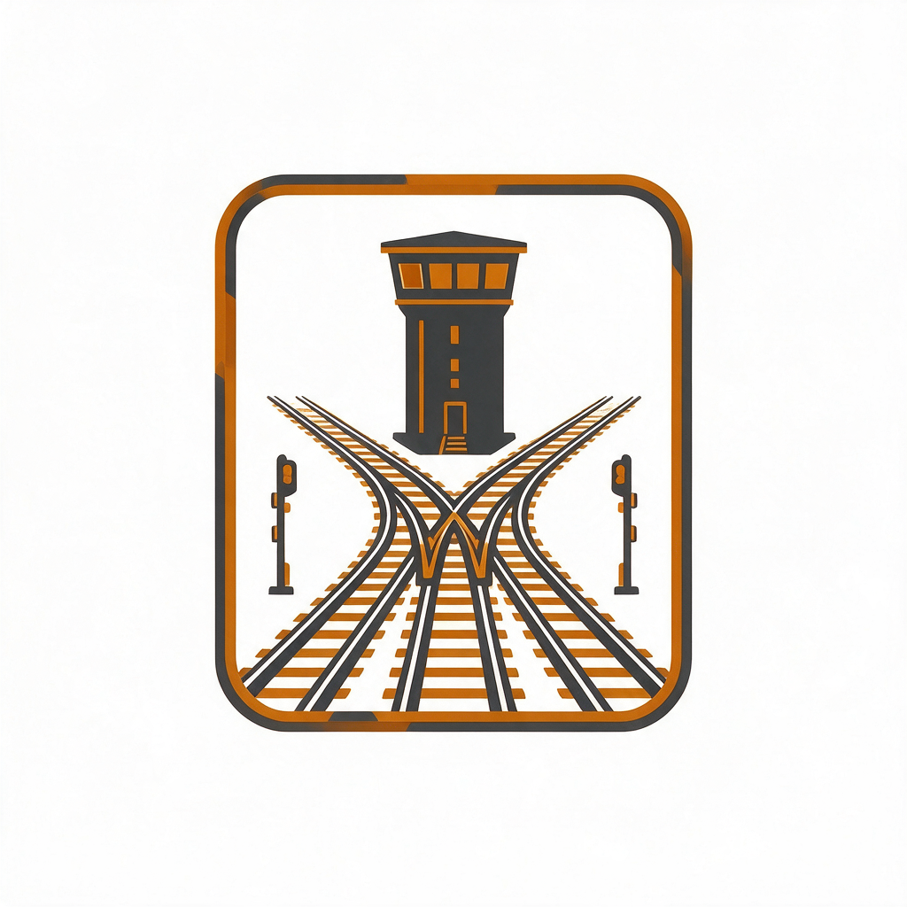
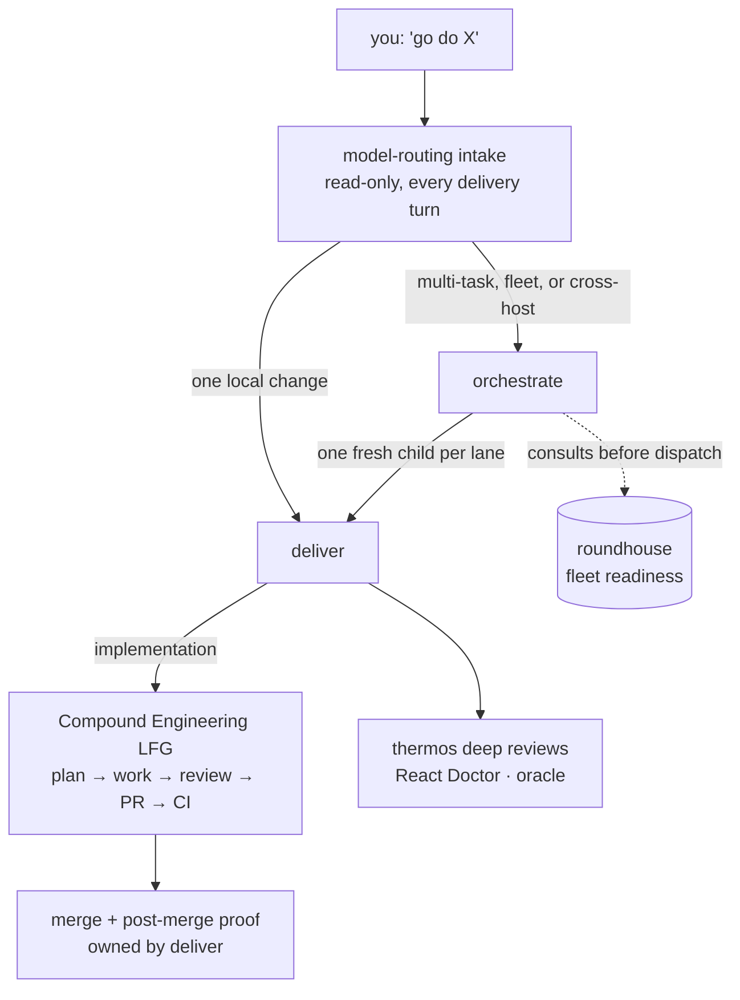
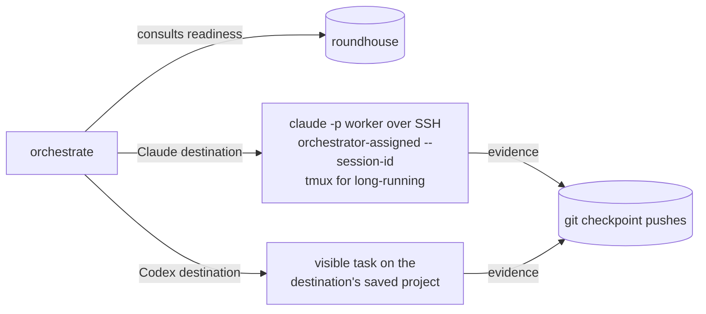

# Using Yardmaster

Yardmaster turns "go do X" into a verified, delivered result. You say what
you want in plain language; it picks the workflow, the model, the budget, and
— when you have a fleet — the machine, then drives the change through
implementation, review, merge, and post-merge proof. You never have to name a
skill: the skills route themselves from what you say.

**What it gets you:**

- *One entry point for delivery.* "Implement…", "fix…", "ship…" — the same
  request works on Codex and Claude Code, on one machine or across your
  fleet, and always ends in evidence, not a claim.
- *Consistent model and budget policy.* Every unit of work gets one recorded
  model/effort/budget decision from a single router, instead of each session
  improvising.
- *Quality you don't have to remember to ask for.* Deep review gates, React
  checks, CI settlement, and post-merge verification are part of the route,
  not favors.
- *A fleet without babysitting.* Cross-machine placement only dispatches to
  hosts that [roundhouse](https://github.com/novotnyllc/roundhouse) has
  verified are ready.

## The mental model

Two decisions happen on every delivery request: *which workflow owns it* and
*which model/effort carries each unit of work*. Yardmaster owns both.

The model decision is layered, and the layers are independent:

| Layer | Question | Answer lives in |
| --- | --- | --- |
| Session model | What model is *this conversation* running as? | Per-harness defaults — see [`harness-model-invocation.md`](../plugins/yardmaster/references/harness-model-invocation.md) |
| Delegated route | What model carries a *bounded unit of work* handed to a carrier? | The router's frozen `yardmaster/model-routing/v1` contract — [`model-routing.md`](../plugins/yardmaster/references/model-routing.md) |

With zero configuration the router already works: Sol for orchestration and
review, Luna for implementation. You only write a catalog if you have
explicit routing policy. GLM-5.2 is reachable from Codex only — a Claude
session structurally cannot both authenticate to Z.ai and keep its
capabilities, so that route intentionally does not exist.

## Getting started

Run **`yardmaster:setup`** (or just say "set up yardmaster"). It inventories
what's installed, installs prerequisites on grouped consent — the
[Compound Engineering](https://github.com/EveryInc/compound-engineering-plugin)
dependency, roundhouse, agent-utilities, gh-stack, tmux/jq — checks that the
API keys your installed plugins need are present (never their values), asks
what your fleet hosts are (enrolling each through `roundhouse:fleet-hosts`),
and ends with a readiness table. "Just this machine, no config" is a complete
and supported answer.

When something later drifts or breaks, **`yardmaster:doctor`** diagnoses —
plugin versions out of sync between harnesses or across hosts, stale
marketplaces, unreachable hosts, missing keys — and proposes minimal fixes,
applied only on consent.

## Everyday use

You talk; the descriptions route:

| You say | What runs |
| --- | --- |
| "implement / fix / ship X" | `deliver` → LFG → merge + proof |
| "plan X" / "brainstorm X" / "debug X" | `deliver` routes to the matching CE stage and stops at that artifact |
| "run this across my machines" / "do these three things" | `orchestrate` with fresh child tasks per lane |
| "review this hard before I commit" | `thermos` (both deep reviewers in parallel, synthesized) |
| "get a second opinion from GPT-5 Pro" | `oracle` one-shot browser review (needs ChatGPT Pro) |
| "set up / add a machine" | `setup` → `roundhouse:fleet-hosts` |
| "is everything in sync?" | `doctor` |

Naming a skill directly also works and changes nothing about the internal
routing — `deliver` still drives CE; it never bypasses it.

### What a delivery actually does

For an implementation request, LFG (Compound Engineering) owns plan → work →
simplify → review → browser test → commit/push/PR → CI and review
settlement. Yardmaster's `deliver` then owns what CE doesn't: the independent
review confirmation, the authorized merge with the repository's strategy, and
the post-merge proof (`gh pr view` showing MERGED, the merge commit reachable
from the base branch, and the smallest applicable post-merge check). A green
CI is not "done" — the proof is.

Narrower asks stop at narrower boundaries: plan-only stops at the plan,
review-only at findings, "local only" at local checks. An explicit stop
always wins.

## Why the outcomes are better

These two skills aren't wrappers — each encodes a set of failure modes it
refuses to let happen.

**`deliver`** (goal-driven delivery) exists because agent work usually dies in the last
mile: something compiles, CI is green, the agent declares victory, and
nothing actually merged — or it merged without anyone independent looking at
it. It structurally prevents that:

- *"Done" has a definition.* A pushed checkpoint, a review-ready branch, an
  open PR, green CI, a merge, and post-merge proof are six different states,
  and the route only ends at the one you asked for.
- *Independent eyes before merge, always.* The adversarial `thermos` pair
  reviews every risky diff pre-commit, and merge requires an independent
  high-effort review pass on record — not the author agreeing with itself.
- *First-pass quality tripwires.* All-mocked tests around cross-layer
  behavior, non-idempotent partial writes, a new helper duplicating an
  existing one, speculative abstraction — each stops the lane before PR,
  when it's cheap to fix.
- *Evidence discipline that's also faster.* Checks are targeted and their
  receipts hash-bound, so nothing reruns a full suite out of superstition —
  stricter verification with less wall time.
- *Interruption-proof.* Checkpoint pushes and restart receipts mean a
  crashed session, a new machine, or a different agent resumes at the next
  invalidated step instead of starting over.
- *Honest failure.* Blocked means the exact failing gate, its evidence, and
  the one decision needed from you — never a shrug.

**`orchestrate`** exists because parallel agent work usually fails one of
two ways: everything in one context window until it collapses, or a swarm of
agents trampling each other's files. The orchestrator's rules target both:

- *The controller never codes.* It decomposes, dispatches, monitors, and
  verifies — staying small, responsive, and un-poisoned by any one lane's
  context. Every lane runs in a fresh, single-use child with only the brief
  it needs.
- *Parallelism without merge hell.* One canonical writer per file, seam
  contracts frozen and hash-bound before dependent lanes start, and a
  thin end-to-end canary through every seam before anything expands.
- *Your turn is classified before it spends.* "What's the status?" never
  spawns work; "go do it" never gets answered with a plan. Budget and task
  authority are consumed deliberately, per destination.
- *No dispatch-then-discover.* Capabilities, projects, and readiness are
  verified before a child is created — on the machine it will run on.
- *Status you can trust.* A terminal-gate ledger backs every report; "only X
  remains" is only utterable when every other gate is provably satisfied,
  excluded, or blocked. Children get archived only after verified
  acceptance and clean worktree/ref handoff — no zombie state.

The net effect: you can hand over bigger asks, walk away longer, and trust
the report you come back to.

## Cross-machine work

Two placement lanes, one per destination harness:

Both lanes verify the destination first (project checkout, harness, plugins,
auth — roundhouse's job) and both return evidence over Git. The Claude worker
is resumable by its session UUID. Raw SSH commands pretending to be an agent
remain forbidden; a real harness process with its own session identity is the
supported thing. For a native-Windows destination, declarative prerequisites
can be staged from any harness through roundhouse's `windows-sftp` lane;
only the in-session Codex task surface drives the interactive half.

## What yardmaster never does

It never edits Compound Engineering (external carrier, ever unchanged); never
treats a pushed checkpoint, green CI, or "no known defects" as completion;
never spends `max`-effort by default (escalation is deliberate); and never
administers machines directly — that's roundhouse's charter.

More depth: [delivery-workflows.md](delivery-workflows.md) (the full
decision rules and cross-host model), [AGENTS.md](../AGENTS.md) (charter),
[`model-routing.md`](../plugins/yardmaster/references/model-routing.md) (the
wire contract), and the harness-surface tables inside
[`orchestrate`](../plugins/yardmaster/skills/orchestrate/SKILL.md)
and
[`deliver`](../plugins/yardmaster/skills/deliver/SKILL.md)
for exactly how Codex concepts map to Claude Code.
