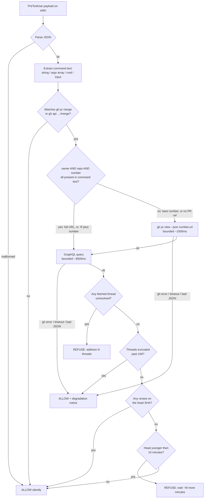

# feat: Make merge authority structural (charter reflex + merge-settlement gate)

**Target repo:** `novotnyllc/railyard`. All paths below are railyard-relative.

## Goal Capsule

**Objective.** A `gh pr merge` issued before review settlement is *mechanically*
refused with actionable guidance, on both harnesses; a merge after settlement
passes untouched; a repository with no reviewers is never blocked.

**Authority hierarchy.** Direct user instruction > this plan's frozen contract >
repository convention > agent judgment. The frozen contract's constraints (no
version bump, no compound-engineering edits, no new dependencies) are hard.

**Stop conditions.** Stop and report — do not substitute an approach — if: the
`gh` GraphQL fields this plan depends on stop resolving; a harness's PreToolUse
matcher provably cannot match its shell tool; or the gate's measured latency
cannot be brought under the 5s PreToolUse budget.

**Execution profile.** One coherent vertical chunk in a dedicated worktree
(`/Users/claire/dev/railyard-lane-u19`, branch `feat/merge-settlement-gate`).
Backend/hooks/docs only — no React gate, no browser test.

**Tail ownership.** This plan's executor stops at open PR + green CI. The
calling `railyard:deliver` lane owns review settlement, merge, and post-merge
proof.

---

## Product Contract

### Summary

Today an orchestrated lane merged railyard PR #1 on green CI **two to four
minutes before** the repo's automated reviewers (GitHub Copilot +
`chatgpt-codex-connector`) posted real findings. Two independent root causes:

1. **The brief hand-inlined the delivery flow** and dropped the
   review-settlement gate. The worker faithfully executed a broken process.
2. **Nothing structural stops a premature merge.** GitHub's
   require-conversation-resolution (now enabled on railyard + roundhouse)
   catches threads that *already exist*; it cannot catch the latency race where
   the reviews have not been posted yet.

Railyard already solves the analogous problem structurally:
`plugins/railyard/hooks/dispatch-gate.js` is a PreToolUse gate that refuses a
`spawn_agent`/`Agent` call missing model or effort. This plan mirrors that shape
for merges, and adds the doctrine line that stops briefs from decaying gate
checklists in the first place.

Layer 1 (doctrine) and Layer 2 (mechanism) are deliberately both present: the
doctrine line prevents the *class* of failure across every future brief, the
gate catches the specific failure even when doctrine is not read.

### Problem Frame

The failure is a **race**, not an omission. Bot reviewers post asynchronously —
minutes after PR open and after every subsequent push. Every existing signal a
merge decision can read is therefore satisfiable *before* the reviews land:

- CI green — passes immediately, says nothing about review.
- `reviewDecision` — null when no human review is required.
- Require-conversation-resolution — vacuously true when zero threads exist yet.

So "CI is green" is never merge authority, and no GitHub-side setting can
express "wait until reviewers have had their chance." That waiting rule lives
in the deliver/LFG skill text, which a hand-inlined brief can silently drop.

Both halves need fixing, because each covers the other's blind spot: doctrine
is skippable, and a mechanism cannot teach a brief how to be written.

### Requirements

- **R1.** The routing charter's process-reflex block carries a default trigger:
  a dispatch brief never inlines a workflow another skill owns — it names the
  owning skill and passes a frozen contract.
- **R2.** The retrospective discipline lenses carry the matching past-tense
  lens, on every surface that already carries the lens set
  (`skills/audit/SKILL.md` and `references/run-audit.md`), including their
  stated lens count.
- **R3.** A PreToolUse hook inspects shell commands and identifies the ones
  that merge a pull request: `gh pr merge` in any argument form, and
  `gh api …/merge`.
- **R4.** When any review thread on the target PR is unresolved, the hook
  **refuses** the command with a non-zero exit and names the count.
- **R5.** When the PR head commit has zero reviews **and** the head is younger
  than the settlement window (10 minutes), the hook **refuses** and states how
  much longer to wait.
- **R6.** When reviews exist for the head and no thread is unresolved, the hook
  **allows** the command silently.
- **R7.** When the head is older than the settlement window and still has zero
  reviews, the hook **allows** — a repository with no reviewers is never
  blocked, at any time.
- **R8.** Any `gh`, network, timeout, or parse failure **allows** the command
  (fail open) and says the gate degraded. Only a determinable violation fails
  closed.
- **R9.** A command that is not a PR merge passes through silently: exit 0, no
  stderr.
- **R10.** The hook is registered on both harnesses (`hooks/claude-hooks.json`,
  `codex/hooks.json`) as a PreToolUse entry with `timeout: 5`, matching the
  existing entries' exact shape including the Windows guard.
- **R11.** The hook's total latency stays well under the 5s PreToolUse budget,
  measured — not asserted.
- **R12.** A refusal message states the remedy exactly, because per the charter
  a tripped guard is never bypassed: the message is the whole remedy.

### Acceptance Examples

- **AE1.** PR has 4 unresolved threads → `gh pr merge 7 --squash` exits 2,
  stderr names 4 unresolved threads and says to address them. (This is the live
  state of PR #1 — a real regression fixture.)
- **AE2.** Head pushed 90 seconds ago, zero reviews → exits 2, stderr says
  roughly 8 minutes remain before settlement.
- **AE3.** Head has 2 reviews, 0 unresolved threads → exit 0, empty stderr.
- **AE4.** Head committed 3 hours ago, zero reviews, zero threads → exit 0 (a
  reviewer-less repo is not blocked).
- **AE5.** `gh` exits non-zero → exit 0, stderr carries a degradation notice.
- **AE6.** `git status` → exit 0, empty stderr.
- **AE7.** Codex argv form `["bash","-lc","gh pr merge 7 --squash"]` behaves
  exactly as AE1–AE5 for the same PR state.

### Scope Boundaries

**In scope:** the charter line, the two lens surfaces, the gate hook, both
harness registrations, the test suite, and the `validate.yml` suite list.

**Deferred to follow-up work:**

- Version bump to 0.6.1 — belongs to the release convergence step. An
  automated reviewer will very likely raise this as a P1; the reply is
  "deferred to release convergence by plan," not a fix.
- Recording gate verdicts to the run log. `dispatch-gate.js` records allowed
  dispatches; the merge gate does not, because nothing consumes a merge-gate
  event yet. Add it when `railyard:audit` grows a merge lens.
- A settlement-window override knob. The window is a constant; tests control
  freshness through the mocked commit timestamp instead, so no production
  config is required.

**Outside this change's identity:** replacing GitHub branch protection,
gating `git push`, or gating merges performed through the GitHub web UI. This
gate covers the agent's own shell path only, which is where the incident
happened.

---

## Planning Contract

### Key Technical Decisions

- **KTD1 — Two layers, doctrine and mechanism.** *(session-settled:
  user-directed — chosen over relying on the newly-enabled
  require-conversation-resolution branch protection alone: branch protection
  catches threads that already exist but is vacuously satisfied during the
  latency race.)* Governs R1, R2, R3.

- **KTD2 — Fail open on error, closed only on a determinable violation.**
  *(session-settled: user-directed — chosen over failing closed on any error: a
  broken gate that blocks every merge in the repository is worse than the race
  it prevents.)* Governs R8.

- **KTD3 — Stale-head allowance.** Past the window with zero reviews → allow.
  *(session-settled: user-directed — chosen over blocking until at least one
  review exists: repositories that genuinely have no reviewers would be blocked
  forever.)* Governs R7.

- **KTD4 — Settlement window is 10 minutes.** *(session-settled: user-directed
  — chosen over a shorter window or none: it matches the observed Copilot +
  Codex bot posting latency in the incident.)* Measured on PR #1: head
  committed `19:16:38Z`, Copilot review `19:20:04Z` (+3m26s), Codex connector
  `19:21:36Z` (+4m58s). 10 minutes is roughly 2x the observed worst case.
  Governs R5.

- **KTD5 — One GraphQL round trip for all settlement data.** *(session-settled:
  user-directed — chosen over several parallel `gh` REST calls: one round trip
  is simpler to bound and keeps the gate far under the 5s budget.)* Validated
  live: `headRefOid` + `reviews(last:100){state,submittedAt,commit{oid}}` +
  `reviewThreads(first:100){totalCount,nodes{isResolved}}` +
  `commits(last:1){commit{committedDate}}` resolve in a single query. Governs
  R11. (`totalCount` is what KTD9's truncation check reads — it is a standard
  field on `PullRequestReviewThreadConnection`; the live validation covered the
  rest of the shape.)

  **Clarification, not a deviation:** the settled decision covers the
  *settlement data*. PR *identity* is a separate concern it did not address —
  see KTD6.

- **KTD6 — Identity resolution needs owner, repo, *and* number; only a full URL
  or an explicit `-R` supplies all three.** The GraphQL query takes
  `owner`/`name`/`number`, so the fast path applies **only** when the command
  text carries all three: a full PR URL (`https://github.com/o/r/pull/7`), or
  `-R owner/repo`/`--repo owner/repo` together with a PR number. Every other
  form — including a **bare number** (`gh pr merge 7`, which names the PR but
  not its repository) and a bare `gh pr merge` — pays one extra
  `gh pr view --json number,url` call, forwarding the same positional and
  `-R` tokens so `gh` itself resolves them. Derive `owner`/`name`/`number` from
  the returned URL. Chosen over hand-rolling repo resolution from
  `git remote` + `rev-parse`: `gh` already owns it, and reusing it is a much
  shorter diff than reimplementing it.

  The bare-number case is the **common** one (it is AE1's exact command), so
  treat two bounded calls as the normal path, not the exception, and budget
  latency accordingly (R11).

  Both calls use an argv array via `execFileSync` — never a shell string — so a
  crafted PR reference cannot inject a command. Both carry an explicit
  `timeout`: `gh pr view` ~1500ms and the GraphQL call ~3500ms, so their sum
  plus process startup stays under the 5s PreToolUse budget, and **both**
  timeouts are caught by the same R8 fail-open path. `execFileSync` has no
  default timeout, so an unbounded call would hang until the harness killed the
  hook — a path whose verdict the gate would not control.

  Identity values reach GraphQL only as bound variables
  (`gh api graphql -F owner=… -F name=… -F number=…`), never concatenated into
  the query string — the same argv discipline applied one layer in, so
  command text parsed out of an agent-composed string cannot shape the query.

- **KTD7 — `committedDate`, not `pushedDate`, dates the head.** GitHub returns
  `pushedDate: null` (verified live on PR #1). `committedDate` is the available
  proxy: for a freshly pushed branch the two are seconds apart. The ceiling —
  a long-dormant local commit pushed later reads as stale and skips the wait —
  is named in a `ponytail:` comment. Upgrade path: the PR timeline's
  `HeadRefForcePushedEvent`/`PullRequestCommit` timestamps, if the proxy ever
  proves wrong in practice.

- **KTD8 — Tests mock `gh` with a PATH shim.** *(resolves the plan's open area.)*
  A fake `gh` executable in a temp dir prepended to `PATH` keeps the production
  path completely real — the hook still spawns `gh` and parses real JSON — and
  requires **zero** production code added for testability, which an env-var
  binary override would not. Consistent with `dispatch-gate.test.mjs`, which
  also isolates through env (`CODEX_HOME`, `RAILYARD_RUN_LOG_DIR`) rather than
  production seams. Ceiling: a POSIX `sh` shim, so these cases do not run on
  Windows; `validate.yml`'s matrix is ubuntu + macOS, so nothing is lost today.

- **KTD9 — Truncated thread pages degrade rather than lie.** `reviewThreads`
  is fetched `first: 100`. If any fetched thread is unresolved, refuse (R4 is
  satisfied). If all 100 are resolved but `totalCount` exceeds 100, the state is
  not determinable — allow with a degradation notice per KTD2, since GitHub's
  own require-conversation-resolution check backstops that pathological case.

- **KTD10 — Mirror `dispatch-gate.js`, do not abstract across the two gates.**
  *(session-settled: user-directed — chosen over a shared hook framework or a
  new idiom: dispatch-gate.js is the repo's proven PreToolUse analogue, and two
  gates do not justify an abstraction.)* Same shebang, header-comment block,
  stdin accumulation, `block()` helper, `[railyard] ` stderr prefix,
  `process.exitCode = 2`, and no `process.exit()` (Windows truncates
  pipe-backed stdout on exit).

### High-Level Technical Design

The gate is one decision tree over two facts — *are there unresolved threads*
and *has the head had its chance* — with every unknown routed to ALLOW.



Every leaf is ALLOW except the two named refusals — the shape KTD2 requires.

### Assumptions

- The Codex PreToolUse matcher accepts a regex alternation, as the Claude
  entry's `Agent|Task` does. If a future Codex build treats the matcher as an
  exact string, the Codex registration silently stops matching — the gate
  fails open, which is the designed failure direction. Recorded rather than
  guarded, because no local probe can settle it without a Codex session.
- `gh` is installed and authenticated wherever the gate runs. When it is not,
  R8 covers the behavior (allow + degradation).

### Accepted residual risks

Recorded, not fixed — each is a consequence of a settled decision rather than a
defect to design around:

- **The gate shares its environment with the agent it constrains.** Because R8
  fails open on any `gh` failure, anything that breaks `gh` resolution
  beforehand — a shim earlier on `PATH`, broken auth — converts every later
  invocation to ALLOW. This is inherent to KTD2's settled fail-open posture and
  to a hook that runs as the same OS user; it is not a new capability, since an
  actor able to write a `PATH` shim can already run the merge outside a gated
  tool call. Named so a future hardening pass (resolve `gh` to an absolute path
  once, verify identity) has a starting point.
- **There is no sanctioned fast path through a tripped gate.** Per the charter a
  tripped guard is waited out or fixed, never bypassed, so the only remedies are
  the two the message names. A genuine minute-three hotfix therefore merges
  through the GitHub UI or waits. Deliberate: an escape hatch is the thing that
  decays into the default.
- **No automated coverage on Windows.** KTD8's POSIX shim means the gate's real
  Windows path (which R10 registers via `commandWindows`) is exercised only by
  the plugin loader test, not by behavior tests.

### Sources / Research

- `plugins/railyard/hooks/dispatch-gate.js` — the PreToolUse shape being
  mirrored: stdin accumulation, `block()`, fail-open default, ponytail ceilings.
- `plugins/railyard/hooks/dispatch-gate.test.mjs` — the test shape being
  mirrored: `spawnSync` with JSON on stdin, hermetic env, assertions on exit
  code and stderr.
- `plugins/railyard/skills/cleanup-codex/scripts/hook.test.mjs:261,274` —
  **verified**: asserts hook *event keys* only (`Object.keys(...).sort()`), not
  entry counts or matchers. Adding a second entry under the existing
  `PreToolUse` key keeps both assertions green, so this file needs no change.
  It also asserts no claude-hooks command matches `/cleanup-codex/` — the new
  command does not.
- `plugins/railyard/references/run-audit.md:152-163` — **verified**: carries the
  parallel lens table *and* the prose count "five standing **discipline
  lenses**", which must become six.
- Live `gh api graphql` against `novotnyllc/railyard` PR #1 — validated every
  field, proved `pushedDate` is null, and measured **0.402s** wall clock for
  the whole round trip.
- `~/.config/railyard/learnings.md` — carries today's incident as a learning
  ("A dispatch brief that inlines the delivery tail must carry review
  settlement, not just CI-green"), and separately mandates **`actionlint`
  before pushing any workflow YAML change** after a malformed expression cost a
  full CI cycle. U3 honors that.
- roundhouse `docs/plans/2026-08-10-001-feat-fleet-dsc-hardening-plan.md` U16 /
  KTD7 — the discipline-retrofit family this work extends. U19 is a sibling of
  U16, not a unit of that plan.

---

## Implementation Units

### U1. Land the doctrine: charter reflex line + retrospective lens

**Goal.** The rule that a brief never inlines another skill's workflow fires by
default, and the retrospective asks whether it did.

**Requirements.** R1, R2. Governed by KTD1.

**Dependencies.** None.

**Files.**
- `plugins/railyard/hooks/routing-charter.js` (modify)
- `plugins/railyard/skills/audit/SKILL.md` (modify)
- `plugins/railyard/references/run-audit.md` (modify)

**Approach.**
1. Append one `· `-prefixed entry to the ponytail process-reflex array in
   `routing-charter.js`, after the "sweeping the PRIMARY record" entry and
   before the closing `- Plan end-to-end…` bullet. Phrase it as a **trigger**,
   matching the five entries added in 6d7fdb7 ("before applying…", "the moment
   a run crosses…") rather than a reminder. Entries wrap at ~76 columns: `"  · "`
   for the first line, `"    "` for continuations. Budget: 2–3 array lines.
2. Add the matching past-tense lens to the discipline-lens bullet list in
   `skills/audit/SKILL.md` (after **Completeness**), same
   `- **Name** — question?` shape as its five siblings.
3. Add the matching row to the lens table in `references/run-audit.md`, and
   change the prose "five standing **discipline lenses**" to "six".

**Patterns to follow.** The five reflexes in commit 6d7fdb7 — read that diff
for voice before writing.

**Test scenarios.**
- `node plugins/railyard/hooks/routing-charter.js` exits 0 and its stdout
  contains the new reflex text.
- `routing-charter.test.mjs` still passes unchanged (it asserts charter
  content; confirm whether it pins an exact line count and update only if it
  genuinely does).
- Lens count in `references/run-audit.md` prose equals the number of table
  rows.

**Verification.** The charter hook still emits valid ambient context with the
new line present; both lens surfaces name the same six lenses.

---

### U2. The merge-settlement gate hook, with its tests

**Goal.** A premature `gh pr merge` is refused with the exact remedy; every
unknown allows.

**Requirements.** R3–R9, R11, R12. Governed by KTD2, KTD3, KTD4, KTD5, KTD6,
KTD7, KTD8, KTD9, KTD10.

**Dependencies.** None (independent of U1).

**Files.**
- `plugins/railyard/hooks/merge-settlement-gate.js` (create)
- `plugins/railyard/hooks/merge-settlement-gate.test.mjs` (create)

**Approach.**
1. **Command extraction.** Read `tool_input`, then collect text from the known
   shapes in one small helper: `command` as string, `command` as string array
   (join with spaces), `cmd` as string, `input` as string array. Anything else
   yields no text → allow. Malformed stdin JSON → allow, exactly as
   `dispatch-gate.js` does.
2. **Merge detection.** Match `gh` followed by `pr … merge`, and `gh api` whose
   path ends in `/merge`. Keep the matcher tight enough that
   `git merge`, `gh pr view`, and a comment mentioning `gh pr merge` inside an
   unrelated command do not trip it — precision over recall, with a `ponytail:`
   comment saying so.
3. **Identity.** Per KTD6, take the fast path only when the text yields all
   three of owner, repo, and number — a full PR URL, or `-R owner/repo` plus a
   number. Otherwise (including a bare number) make one
   `gh pr view --json number,url` call forwarding the same positional and `-R`
   tokens, `timeout` ~1500ms, and derive `owner`/`name`/`number` from the
   returned URL.
4. **Settlement data.** One `gh api graphql` call with the KTD5 query, via
   `execFileSync` with an argv array, `timeout` ~3500ms, stdout captured, and
   identity passed as `-F` bound variables — never interpolated into the query
   text. Both calls' failures and timeouts land on the same R8 fail-open path.
5. **Decide** per the HTD tree. Compute "reviews on the head" by matching
   `review.commit.oid === headRefOid`.
6. **Messages.** Refusals use `block()` with the `[railyard] ` prefix and state
   the remedy: the unresolved-thread count and "address them, then resolve the
   threads", or the remaining wait rounded to a human unit. Never suggest a
   bypass — per the charter, a tripped guard is fixed or waited out.

**Execution note.** Write the tests alongside the hook and run them as the
inner loop; this unit's whole value is the decision tree's edge behavior, so
the suite is the design feedback, not an afterthought.

**Technical design (directional).** Roughly:

```
main(payload):
  text = extractCommand(payload.tool_input)      # 4 shapes, else ""
  if not isPrMerge(text): return ALLOW
  try:
    id  = fullTarget(text) or ghPrView(text)     # KTD6, bounded ~1500ms
    d   = ghGraphql(id)                          # KTD5, bounded ~3500ms
  except: return ALLOW_DEGRADED(reason)          # R8: both calls land here
  unresolved = d.threads.filter(!isResolved)
  if unresolved.length: return REFUSE_THREADS(unresolved.length)
  if d.threadsTotal > d.threads.length: return ALLOW_DEGRADED("threads truncated")
  if d.reviews.any(r => r.commit.oid == d.headRefOid): return ALLOW
  age = now - d.headCommittedDate
  if age < WINDOW: return REFUSE_WAIT(WINDOW - age)
  return ALLOW
```

**Patterns to follow.** `plugins/railyard/hooks/dispatch-gate.js` end to end.

**Test scenarios.** (fake `gh` via PATH shim per KTD8; the shim emits canned
JSON and controls `committedDate` to set head freshness)
- Covers AE1. Two unresolved threads among four → exit 2; stderr matches the
  unresolved count and says to address them.
- Covers AE2. Zero reviews, `committedDate` 90s ago → exit 2; stderr names a
  remaining wait and does **not** suggest any bypass flag.
- Covers AE3. One review whose `commit.oid` equals `headRefOid`, all threads
  resolved → exit 0, stderr empty.
- Covers AE4. Zero reviews, zero threads, `committedDate` 3h ago → exit 0.
- A review exists but only on an **older** SHA than `headRefOid`, head fresh →
  exit 2 (a stale review is not settlement for the new head).
- Covers AE5. Shim exits 1 → exit 0 with a degradation notice on stderr.
- Shim hangs past the bounded timeout → exit 0 with a degradation notice.
- Shim prints non-JSON → exit 0 with a degradation notice.
- All 100 fetched threads resolved but `totalCount` 250 → exit 0 with a
  degradation notice (KTD9).
- Covers AE6. `{tool_name:"Bash",tool_input:{command:"git status"}}` → exit 0,
  stderr empty, and the shim was never invoked.
- `gh pr view` (not a merge) → exit 0, stderr empty.
- Covers AE7. Codex `shell` argv array
  `["bash","-lc","gh pr merge 7 --squash"]` → same verdict as AE1 for the same
  state.
- Codex `exec_command` string `cmd` → same verdict.
- Codex `unified_exec` `input` array → same verdict.
- `gh api repos/o/r/pulls/7/merge` → gated (not skipped).
- A full PR URL resolves without calling `gh pr view` (fast path).
- `-R owner/repo 7` resolves without calling `gh pr view` (fast path).
- A **bare number** (`gh pr merge 7`) *does* call `gh pr view` — assert the shim
  saw that call, since this is AE1's form and the plan's common path.
- `gh pr view` failing or timing out → exit 0 with a degradation notice (the
  identity call's failure path, distinct from the GraphQL call's).
- Malformed stdin (`"not json"`) → exit 0, stderr empty.
- Missing `tool_input` entirely → exit 0 (allow; unlike dispatch-gate, an
  unreadable *merge* payload cannot be a determinable violation).

**Verification.** `node --test plugins/railyard/hooks/merge-settlement-gate.test.mjs`
green; and a measured real-world latency: run the hook against live PR #1 with
`gh` unmocked, timed, and record the wall-clock number.

---

### U3. Register on both harnesses and wire the suite into CI

**Goal.** The gate actually loads on both harnesses, and its suite runs in CI.

**Requirements.** R10. Governed by KTD10.

**Dependencies.** U2 (the hook must exist to be registered).

**Files.**
- `plugins/railyard/hooks/claude-hooks.json` (modify)
- `plugins/railyard/codex/hooks.json` (modify)
- `.github/workflows/validate.yml` (modify)

**Approach.**
1. Add a second object to each file's existing `PreToolUse` array — never a new
   event key, which would break `hook.test.mjs`'s key assertions. Copy the
   dispatch-gate entry's exact shape: `type`, `command` with
   `${CLAUDE_PLUGIN_ROOT}`, `commandWindows` with the
   `if (Get-Command node -ErrorAction SilentlyContinue) { … }` guard, and
   `timeout: 5`.
2. Matchers: `Bash` for Claude; `shell|local_shell|exec_command|unified_exec`
   for Codex (its exec tool name varies by enabled feature — see Assumptions).
3. Extend each file's top-level `description` to name the merge gate, matching
   the existing run-on prose voice.
4. Append the new test file to the single `node --test …` line in
   `validate.yml`.
5. Run `actionlint` on `validate.yml` **before** any push — the standing
   learning from a previously wasted CI cycle.

**Test scenarios.**
- `hook.test.mjs` passes unchanged (proves the key-set assertions survive).
- Both JSON files parse, and each `PreToolUse` array has exactly two entries
  whose commands point at the two distinct gates.
- Every new entry declares `timeout: 5` and carries a `commandWindows` variant.
- `actionlint .github/workflows/validate.yml` clean.

**Verification.** `claude plugin details railyard --plugin-dir …` still loads
the plugin without a hook warning (the existing loader test covers this,
skipping cleanly if the CLI is absent); the full contract suite is green.

---

## Verification Contract

**The gate command — exact, with an unmasked exit.** Run from
`/Users/claire/dev/railyard-lane-u19`, matching `validate.yml`'s JS-contract
step verbatim plus the new suite:

```bash
set -o pipefail
node --test --test-timeout=60000 --test-force-exit \
  plugins/railyard/scripts/model-routing.test.mjs \
  plugins/railyard/skills/orchestrate/scripts/delivery-contracts.test.mjs \
  plugins/railyard/skills/oracle/scripts/oracle-route.test.mjs \
  plugins/railyard/skills/oracle/scripts/ensure-oracle.test.mjs \
  plugins/railyard/skills/cleanup-codex/scripts/inventory.test.mjs \
  plugins/railyard/skills/cleanup-codex/scripts/snapshot-reap.test.mjs \
  plugins/railyard/skills/cleanup-codex/scripts/recycle.test.mjs \
  plugins/railyard/skills/cleanup-codex/scripts/hook.test.mjs \
  plugins/railyard/skills/cleanup-codex/scripts/canary.test.mjs \
  plugins/railyard/hooks/routing-nudge.test.mjs \
  plugins/railyard/hooks/dispatch-gate.test.mjs \
  plugins/railyard/hooks/routing-charter.test.mjs \
  plugins/railyard/hooks/railyard-retro.test.mjs \
  plugins/railyard/hooks/merge-settlement-gate.test.mjs
echo "EXIT=$?"
```

Also run the manifest-validation step from `validate.yml`, and
`actionlint .github/workflows/validate.yml`.

**Evidence rules.** A green verdict requires the command, its *unmasked*
process exit, and proof the tests ran — an output tail. A piped tool's exit is
not evidence. Scoped/tiered: during the U2 inner loop run only
`merge-settlement-gate.test.mjs`; run the full list once at freeze.

**Latency gate.** Report a measured wall-clock number for the hook's real `gh`
path — specifically the **two-call** path (`gh pr view` then GraphQL), since per
KTD6 that is the common case, not the exception. Baseline: the bare GraphQL round
trip alone measured 0.402s, so budget roughly double plus Node startup. Anything
approaching 5s is a stop condition, not a note.

## Definition of Done

**Global.**
- R1–R12 satisfied; AE1–AE7 each have a passing test.
- Full contract suite green with receipts (command, unmasked exit, output tail).
- `actionlint` clean on the workflow change.
- Measured gate latency reported and well under 5s.
- No version bump; no `compound-engineering` file touched; no new dependency in
  any manifest.
- Thermos gate run on the scoped diff; every real finding fixed, every non-fix
  recorded with evidence.
- Branch pushed, PR open against `main`, CI green.
- No dead-end or experimental code left in the diff — no abandoned helper, no
  commented-out approach, no unused env-var seam from a rejected mock design.

**Per unit.**
- **U1** — new reflex present in charter stdout; six lenses named consistently
  on both surfaces; `routing-charter.test.mjs` green.
- **U2** — every listed test scenario present and passing; hook mirrors
  `dispatch-gate.js` conventions; each deliberate ceiling (KTD7 date proxy,
  KTD8 POSIX shim, KTD9 truncation, matcher precision) carries a `ponytail:`
  comment naming its upgrade path.
- **U3** — both harness files parse with two PreToolUse entries each;
  `hook.test.mjs` green unchanged; suite listed in `validate.yml`.

**Not done here (owned by the calling deliver lane).** Review settlement — wait
up to 10 minutes after open and after each push for the Copilot + Codex
reviews, fix real findings, reply with rationale on declines (expect a
version-bump P1: deferred by plan) — then merge, post-merge proof, and worktree
cleanup.
