# feat: Docs consolidation, public site, and factoring corrections

**Target repos:** a new `novotnyllc/novotnyllc.github.io` (the site), plus corrective
changes in `novotnyllc/roundhouse`, `novotnyllc/railyard`, and `novotnyllc/marketplace`.
Paths are absolute or labeled with their repo.

**Continuity:** this plan continues
`roundhouse docs/plans/2026-08-10-001-feat-fleet-dsc-hardening-plan.md`. U-IDs continue
at **U20**. Three units from that plan are still open and are carried here (its U11, U13,
U14 → U22, U24, U23). Its U7/U8/U9 (fleet bring-up) are deliberately *not* renumbered —
they run last, after this plan's release, and are referenced by their original IDs.

---

## Summary

Documentation for the product is currently spread across two repos with no site, no
generator, and no shared navigation: 24 human-facing markdown files in
`/Users/claire/dev/railyard/docs/` and 30 in `/Users/claire/dev/roundhouse/docs/`, plus
per-repo `README.md` and `AGENTS.md`. The two `docs/site/` trees already assume a
published site that does not exist — `roundhouse/docs/site/index.md:1-3` carries the
comment *"`/railyard` and `/roundhouse` are site-absolute placeholders … they resolve
once both docs sites are published together."* Neither repo has a generator, a Pages
workflow, front matter, or a nav config, and **no repo in the org has GitHub Pages
enabled** (verified: `gh api repos/novotnyllc/<repo>/pages` returns 404 for railyard,
roundhouse, marketplace, agent-utilities, tart-xcode-runner).

Three factoring corrections ride along with the consolidation:

1. **agent-utilities is off the product story.** It is Claire's personal toolbox. It is
   currently named in the brand kit (`railyard/docs/brand.md:12,27,48`) and both charters
   as a family member; the site must not carry it.
2. **chezmoi is an optional integration, not a dependency.** The runtime is already
   correctly guarded (`roundhouse/plugins/roundhouse/scripts/lib/fleet-fold.sh:300-310`),
   but the *surface* advertises it: the plugin manifest lists `"chezmoi"` as a keyword
   and "dotfile baselines" in its description
   (`roundhouse/plugins/roundhouse/.claude-plugin/plugin.json:4,19`), the marketplace
   description says "packages, dotfiles, auth", the README's Bays table gives it a row
   (`roundhouse/README.md:47`), and `fleet-inventory`'s frontmatter description names
   "chezmoi state" among its headline items
   (`roundhouse/plugins/roundhouse/skills/fleet-inventory/SKILL.md:3`). A reader
   reasonably concludes chezmoi is required. Nothing in the code says so; the plan makes
   the surface match the code and adds a test that keeps it true.
3. **tart-xcode-runner is product-adjacent and gets a deliberate place.** `railyard:setup`
   and `railyard:deliver` already recommend it
   (`railyard/plugins/railyard/skills/setup/SKILL.md:91-93`,
   `railyard/plugins/railyard/skills/deliver/SKILL.md:403-406`). It becomes an
   *integration* with its own scenario page, not a fourth family member.

The site is one repo (`novotnyllc.github.io`, serving the org root), built by GitHub
Pages' own Jekyll — no Actions workflow, no local toolchain. The `docs/site/**` trees move
into it and are deleted from their source repos; agent-consumed docs (`AGENTS.md`,
`docs/agents/**`, `plugins/*/skills/*/SKILL.md`) and the engineering record
(`docs/plans/**`, `docs/specs/**`) stay exactly where they are.

Sequencing follows the batch-then-propagate rule: everything under `plugins/**` lands in
**one 0.7.0 release cycle** (U20–U23 + U36); the site is docs-only and ships continuously
alongside it; the fleet bring-up (predecessor U7/U8/U9) runs **last** so it distributes
that release's bytes as its payload.

---

## Problem Frame

**Docs.** There is no reader path. A person who hears "railyard" lands on a GitHub README,
follows `docs/guide.md`, and then either stops or wanders into `docs/site/`, which is a
folder of orphan markdown with no index, no nav, and cross-repo links (`/railyard`,
`/roundhouse`) that resolve to nothing. The one genuine landing page — the two-product
family narrative — lives in the *wrong repo*: `roundhouse/docs/site/index.md` is a
railyard+roundhouse page sitting inside roundhouse's tree.

**Value.** Almost every page describes *mechanism* (the store's four-layer fold, the
signing ratchet, the config schema). Very little states *what you get*. The one page that
comes closest, `railyard/docs/site/index.md`, opens with the problem and a transcript —
good — but there is no page per usage scenario, and the scenarios are the product: this
system does eight or nine genuinely different jobs and a reader can currently discover
maybe two.

**Factoring.** Content is placed by *which repo built it* rather than *who reads it*.
That produces the three specific defects above (personal toolbox in the family story,
personal dotfiles choice presented as a product capability, product-adjacent VM runner
with no place at all), plus duplicated shape (two `comparison.md`, two `credits.md`, two
`lifecycle.md`, two `charter.md`, two near-identical `release-coupling.md`).

**Style.** The standing rule is that public docs describe what *is*: positive description,
no negation, no internal history, no "unlike X" framing. Two concrete violations exist,
and one house-wide convention conflicts with the rule — the `## Boundaries` section in all
20 skill pages is structured entirely as a list of what a skill *never* does.

---

## Requirements

Each requirement traces to one of the seven frozen decisions (D1–D7, 2026-08-11).

- **R1 (D1)** — One published site owns the human-facing story; every human-facing doc has
  exactly one home, chosen by audience, and no content is duplicated across repos.
- **R2 (D1)** — Repo-local agent-consumed docs stay in their repos, where the tools read
  them: `AGENTS.md`, `docs/agents/**`, `plugins/*/skills/*/SKILL.md`.
- **R3 (D2)** — agent-utilities appears nowhere in the product story: not on the site, not
  in the brand kit's family, not in the product charters' "family" framing. Its own docs
  stay in its own repo, unchanged.
- **R4 (D3)** — No core code path requires chezmoi, and this is enforced by a test, not by
  a comment.
- **R5 (D3)** — chezmoi is presented as a named optional integration everywhere it is
  named: manifests, marketplace catalog, READMEs, skill descriptions, site.
- **R6 (D4)** — The site's organizing idea is agents and agent skills; every page answers
  "what can an agent now do for me."
- **R7 (D5)** — The site is published on GitHub Pages at the org's default URL, from one
  repo, with a cutover to a custom domain that requires no link rewrites.
- **R8 (D6)** — Every scenario has a page that states the value in its first sentence,
  shows the easy path, and cites a real proof point from the running system.
- **R9 (D7)** — Desired-state configuration is presented twice, deliberately: as part of
  the fleet story, and as a standalone capability usable with none of the rest.
- **R10 (D1, style memory)** — Public pages describe what is: positive description, no
  negation, no internal history.
- **R11 (D1)** — tart-xcode-runner has a deliberate place in the story.
- **R12 (sequencing)** — All `plugins/**` changes in this plan land in one release cycle;
  the fleet bring-up runs after it and uses it as payload.

---

## Key Technical Decisions

### KTD1 — One site repo at the org root: `novotnyllc/novotnyllc.github.io`

`novotnyllc` is a GitHub **Organization** (verified: `gh api users/novotnyllc` →
`"Organization"`), so a repo named `novotnyllc.github.io` publishes at
`https://novotnyllc.github.io/` with **no path prefix**. Sections live at
`/railyard/...` and `/roundhouse/...`.

This is the cleanest of the two candidates for one decisive reason: **the existing content
already assumes it.** `roundhouse/docs/site/index.md:1-3` writes cross-repo links as
site-absolute `/railyard` and `/roundhouse`, and railyard's site pages carry the same
comment convention. Those paths resolve at a site root and nowhere else.

It is also the painless-cutover option (R7). A custom domain on an org-root site is a
`CNAME` file plus DNS; every internal link keeps working because every internal link is
already root-relative. Project Pages at `https://novotnyllc.github.io/railyard/` would
bake `/railyard` into the *base path* as well as the section path, and cutover to
`https://example.com/` would require rewriting every absolute link and every asset URL.

**Alternatives considered.** (a) *railyard project Pages* — rejected on the cutover cost
above, and because it makes railyard structurally senior to roundhouse in a story where
they are siblings. (b) *Two sites, one per repo* — rejected: duplicated chrome, split
navigation, two search indexes, and it re-creates exactly the fragmentation D1 asks to
remove. (c) *A `docs` repo published to project Pages* — same base-path problem as (a)
with no benefit.

### KTD2 — GitHub's native Jekyll build, `just-the-docs` remote theme, no Actions workflow

Publish with the classic "deploy from a branch" setting. GitHub Pages builds Jekyll
server-side; the repo needs a `_config.yml` and markdown, nothing else. No CI workflow,
no Ruby on Claire's machine, no node toolchain, no build step to break.

Theme: `remote_theme: just-the-docs/just-the-docs@v0.10.1`. `jekyll-remote-theme` is on
the Pages plugin allowlist, so the native build resolves it. It supplies the two things
40+ pages actually need — a nav tree driven by per-page front matter (`title`,
`nav_order`, `parent`) and client-side search — plus light/dark. The landing page gets a
committed `_layouts/home.html` override styled from the brand kit, so the front door is a
value page rather than a docs index.

**Alternatives considered.** (a) *`minima`* (Pages default) — no nav, no search; a 40-page
site with no nav is not a site. (b) *mkdocs-material* — better docs UX, but needs a Python
toolchain and an Actions build; a heavier dependency than the content justifies.
(c) *Astro/Starlight or any node SSG* — same objection, more so. (d) *Committed static
HTML* — no nav, no search, 40 hand-maintained pages; strictly worse than (a).
(e) *Actions-built Jekyll* — only needed for plugins outside the Pages allowlist; nothing
here needs one. Adopt it later if that changes.

**Ceiling.** `just-the-docs` requires front matter on every page. That is real work, but
it is the same work as designing the IA, so it is not an added cost.

### KTD3 — Move `docs/site/**` out of the source repos rather than syncing it

The site repo becomes the single source for human-facing docs; `railyard/docs/site/` and
`roundhouse/docs/site/` are deleted and their READMEs link out. No submodules, no
subtrees, no sync workflow, no generated copies.

This is the only option with no drift surface. Any sync mechanism creates a second copy
that can be edited on the wrong side; a submodule adds a checkout step to every contributor
and does not actually consolidate anything. It also has a release-cycle benefit: with
site content out of `plugins/**` *and* out of the plugin repos entirely, site edits are
free of the release machinery
(`railyard/docs/agents/release-coupling.md`, "Documentation-only exemption").

**Cost, stated plainly.** The per-skill site pages currently sit beside the `SKILL.md`
they describe; moving them makes drift between the two slightly easier. They can already
drift today (they are separate files), so this changes degree, not kind. Mitigated by
U34's link check plus the skill-page template naming the skill's source path.

### KTD4 — The chezmoi seam is made explicit at the surface; the sealed-plan schema is left alone

The audit found the runtime already correct:
`fleet-fold.sh:300-310` guards every co-ownership probe with
`command -v chezmoi >/dev/null 2>&1 || return 1`, the POSIX and Windows inventory
collectors both guard and emit `absent` rather than failing
(`plugins/roundhouse/scripts/collect-posix:2797-2818`,
`plugins/roundhouse/scripts/collect-windows.ps1:3013-3014`), `fleet-readiness` has zero
chezmoi references, and the design spec already states the invariant
(`docs/specs/2026-08-06-dsc-storage-design-v2.md:539-543`, "no code path may require
chezmoi to be present").

What is *not* explicit: the sealed-plan schema names chezmoi as a first-class `domain`,
`kind` (`chezmoi_state`), and operation pair (`chezmoi-pull` / `chezmoi-apply`) —
`plan-verify.sh:591`, `plan-seal.sh:38,84`, `plan-apply.sh:159-233`,
`apply-windows.ps1:404-1601`. **Leave it.** Generalizing to a provider abstraction means
changing a signed schema, on two platforms, for a hypothetical second dotfiles provider
that does not exist. The vocabulary is inert when unused: a plan that never targets the
chezmoi domain never touches any of it.

The seam becomes explicit at the surface instead — product descriptions (U21), the skill's
own declaration (U21), a dedicated Integrations page (U31) — and becomes *enforced* by a
PATH-scrubbed contract test (U20) rather than by a code comment.

`# ponytail: named-provider schema kept; introduce a provider abstraction only when a
second dotfiles engine actually needs one.`

### KTD5 — Content is placed by the factoring test, not by which repo built it

Every human-facing doc must pass, in order:

1. **Does a tool read this path at runtime?** (a harness loading `SKILL.md`, an agent
   reading `AGENTS.md`, a CI job reading `docs/agents/verification.md`.) → stays repo-local,
   next to the tool. Never moves.
2. **Is it an internal decision record or history?** (`docs/plans/**`, `docs/specs/**`,
   announcement drafts.) → stays repo-local, never published. R10 forbids internal history
   on the site.
3. **Would a reader need to know which repo owns the capability in order to use it?**
   If no → the site presents it by *job*, not by repo.
4. **Who is the reader?** Evaluator ("should I use this?") → the value tier. Operator
   ("how do I do X?") → the guides tier. Contributor → repo-local `docs/agents/`.
5. **Does it exist twice?** → one canonical page; the other becomes a link or is deleted.

Test 3 is the one that changes today's structure most: the site's top level is organized
by *what you are trying to do*, and the railyard/roundhouse split appears only where a
reader must install one or the other.

### KTD6 — Retire the comparison pages; state value directly

`railyard/docs/site/comparison.md` and `roundhouse/docs/site/comparison.md` are built
end-to-end on define-by-contrast — the exact framing R10 forbids
(`roundhouse/docs/site/comparison.md:15` "Roundhouse doesn't compete with that lane";
`railyard/docs/site/comparison.md:71` "One name on this page isn't a comparison").
They do not survive a positive-description rewrite as comparison pages, because a
comparison page's content *is* the contrast.

Salvage the two parts that are positive claims: the capability table (restated as
"what this does", on the landing page) and the credited substrate (Compound Engineering,
ponytail, jj, chezmoi, OpenSSH — already covered by both `credits.md` pages, which merge
into one). This serves R8 better than the comparison pages did: a scenario page that says
what you get beats a table saying what someone else lacks.

### KTD7 — `Boundaries` sections are reframed as `Scope`, not deleted

All 20 skill pages end with a `## Boundaries` list of what the skill never does. Read
strictly, R10 deletes that convention. Deleting it would be wrong: those lines are a
safety promise — they tell a reader what an agent will not touch on their machine.

Reframe rather than remove: `## Scope` states the same fact positively — what the skill
operates on, and which skill owns the neighbouring concern. "Never administers hosts
itself" becomes "hands host administration to `roundhouse:fleet-*`." Same information,
same guarantee, positive voice. This is a rewrite across 20 pages and is scoped as its own
unit (U32).

### KTD8 — One coordinated 0.7.0 across railyard and roundhouse

Current: railyard `0.6.1` (origin `646af00`), roundhouse `0.6.2`, marketplace pinned at
`4f73230`. This plan's `plugins/**` changes are user-visible (product descriptions change,
a new readiness preflight appears, plugin convergence starts comparing bytes) though not
breaking. Cut **0.7.0 for both** in one cycle even though railyard's own change is small,
because the release is the *payload* for the fleet propagation proof (predecessor U7) and
one version across the family is cheaper to reason about on five hosts than a mixed
0.6.3/0.7.0. U24 (actionlint) touches only `.github/**` and carries no version coupling
per the documentation-only exemption.

---

## The chezmoi seam design

**Invariant (the thing being made explicit):** roundhouse detects chezmoi and cooperates
with it when present. Every core path — inventory, fold, convergence, readiness, doctor —
completes normally when chezmoi is absent from `PATH`.

**Three layers, and what changes in each:**

| Layer | Today | After |
| --- | --- | --- |
| **Runtime** | Correct but only asserted by comment + one fold test (`scripts/tests/70-fold.sh:377-395`) | Correct *and* enforced by a PATH-scrubbed end-to-end contract test (U20) |
| **Schema** | chezmoi is a named `domain`/`kind`/operation pair in the sealed-plan schema | Unchanged (KTD4). Documented as "the chezmoi operation family", reachable only by a plan that targets it |
| **Surface** | Advertised as a headline capability in 5 places | Declared as one named optional integration (U21, U31) |

**Surface inventory — every place that currently reads as a dependency:**

| Location | Current | Change |
| --- | --- | --- |
| `roundhouse/plugins/roundhouse/.claude-plugin/plugin.json:4` (+ `.codex-plugin` twin) | description: "package and dotfile baselines" | drop "dotfile" from the headline description |
| same file, `:19` | `"chezmoi"` in `keywords` | keep — a discovery keyword is not a dependency claim |
| `marketplace/.claude-plugin/marketplace.json` (+ `.agents` twin) roundhouse entry | "packages, dotfiles, auth" | re-pin with the corrected description via `scripts/repin` |
| `roundhouse/README.md:47` Bays table | `Baselines \| fleet-update (packages/tools), fleet-chezmoi (dotfiles)` | Baselines row keeps `fleet-update`; `fleet-chezmoi` moves to a new "Integrations" row labeled optional |
| `roundhouse/README.md:9,18` | "keeps harnesses, plugins, packages, and dotfiles in sync"; "auth, packages, dotfiles" | drop dotfiles from both headline bullets |
| `roundhouse/plugins/roundhouse/skills/fleet-inventory/SKILL.md:3` | frontmatter description lists "chezmoi state" | remove from the description (it stays a selectable inventory section) |
| `roundhouse/plugins/roundhouse/skills/fleet-chezmoi/SKILL.md` (+ `agents/openai.yaml`) | reads as a peer fleet skill | first line declares it as the optional chezmoi integration, active when chezmoi is installed |
| `roundhouse/plugins/roundhouse/skills/fleet-auth/SKILL.md:19` | delegates `chezmoi` strategy to `fleet-chezmoi` | unchanged — correct as written |
| `roundhouse/plugins/roundhouse/skills/fleet-agents/SKILL.md:710` | "Reconcile the owning file through `fleet-chezmoi` where possible" | add "when chezmoi is present" |
| `roundhouse/docs/site/index.md:171`, `comparison.md:8`, `credits.md:33-36`, `config.md:238`, `operating.md:231`, `skills/fleet-chezmoi.md`, `skills/fleet-inventory.md:7`, `skills/fleet-auth.md:39` | site prose | handled by the site migration; chezmoi content consolidates onto one Integrations page (U31) |
| `railyard/plugins/railyard/skills/setup/SKILL.md:27,133` | already says "(optional)" and "never depends on" | keep the optionality; the `:133` "never depends on" phrasing gets a positive rewrite under R10 |

**What is explicitly *not* changed:** the `fleet-chezmoi` skill stays shipped inside the
roundhouse plugin. It is inert when chezmoi is absent, and extracting one skill into its
own plugin buys packaging overhead and a second release cadence for no behavior change.
(Recorded as OQ2 — it is a product-packaging call, not an engineering one.)

---

## Site information architecture

```
/                          Landing — the value page (custom home layout)
/start/                    Start here
  install                  Install one or both plugins; what each install gets you
  first-delivery           "go do X" → merged change, on one machine, in ten minutes
  first-machine            Day one of a fleet: one machine, enrolled and converged
/what-it-does/             THE VALUE TIER — one page per scenario (see table below)
/skills/                   Skill reference, grouped by job (see U30)
/delivery/                 How delivery works
  lifecycle                One prompt, end to end
  routing                  Model, effort, budget, transport
  gates                    Review settlement, Thermos, merge authority, post-merge proof
  audit                    Reconstructing a run
/fleet/                    How the fleet works
  store                    The fleet store and the four-layer fold
  convergence              One edit, keystroke to applied
  trust                    Signing ratchet, roster, enrollment, revocation
  operating                The operator's verb reference
  config                   config.json reference
  why-jj                   Why the store is a jj repo
/desired-state/            DSC — presented twice, deliberately (D7)
  index                    Declare it, canary it, prove it — standalone
  in-a-fleet               The same capability as part of the fleet story
  scaling                  Breakpoints and mitigations (from roundhouse docs/specs)
/integrations/             Named optional integrations
  chezmoi                  Optional: cooperate with chezmoi-managed dotfiles
  tart-xcode-runner        Optional: Xcode builds and UI tests in disposable VMs
  1password                Optional: auth artifact custody
  unifi                    Optional: network gear
  tailscale-ssh            Optional: transport
/security/                 Threat model, trust boundaries, what the design rests on
/credits/                  One merged credits page
```

**Scenario pages (`/what-it-does/`).** Each follows one shape: **value first sentence →
the easy path (what you type) → what actually happens → proof point (a real artifact from
the running system) → where to go next.** Nine pages:

| # | Page | Value in one line | Easy path | Proof point |
| --- | --- | --- | --- | --- |
| 1 | `ship-a-change` | Say "go do X" and get back a merged, verified change | `railyard:deliver` on one machine, no fleet | Post-merge proof checks for a merged commit reachable from base — not CI green (`railyard/docs/site/lifecycle.md`) |
| 2 | `harden-review` | Reviews land before the merge does, mechanically | Thermos pair + the merge-settlement gate | `plugins/railyard/hooks/` merge gate refuses `gh pr merge` during the reviewer latency race (railyard U19, `docs/plans/2026-08-10-001-feat-merge-settlement-gate-plan.md`) |
| 3 | `keep-machines-current` | Every machine runs the same plugins, skills, and packages | `fleet-update`, `fleet-run` | The live fleet: 5 hosts, both harnesses, evidence on `host/<name>` branches |
| 4 | `declare-desired-state` | Write down what a machine should be; it becomes true, with evidence | `fleet.yaml` + `fleet-run`; canary first | Canary → downstream gate; per-item journal evidence (`/fleet/convergence`) |
| 5 | `work-across-harnesses` | One request, whichever of Claude Code and Codex fits | `railyard:model-routing`; explicit cross-harness opt-in | Routing is recorded per dispatch, never improvised (`railyard/docs/delivery-workflows.md`) |
| 6 | `ios-and-mac-apps` | Your agent runs the UI tests; your screen stays yours | `tart-xcode-runner`, auto-preferred by `deliver` | `deliver` prefers it for XCUITests (`plugins/railyard/skills/deliver/SKILL.md:403-406`) |
| 7 | `run-work-on-another-machine` | Point work at the machine that should do it | `railyard:orchestrate` + `roundhouse:fleet-readiness` | Readiness is a go/no-go the dispatcher actually consults before placement |
| 8 | `administer-remotely` | Fix a machine you're not sitting at | `roundhouse:remote-mac`, `ssh-doctor` | Signed SSH certificate enrollment; the Windows SFTP lane |
| 9 | `control-model-cost` | Cheap work runs cheap; hard work gets the good model | model policy config | Budget accounting + per-dispatch effort in the run log |

Two more that are strong candidates rather than certainties, folded into pages above
unless they earn their own: **"distribute a skill you wrote"** (write once, the fleet
converges it — the sharpest expression of D4, currently the second half of page 3) and
**"decide whether to trust this with your machines"** (the evaluator's read of
`/security/`). OQ4 asks whether the first deserves its own page.

**Landing page.** Value proposition in the first sentence, per `brand.md`. Four promises
mapped to the four things a reader can start doing today, one terminal transcript, install,
and a link into `/what-it-does/`. Brand tokens: signal amber `#B45309` (primary), brick
rust `#7C2D12`, charcoal ink `#3D3D3D`, clean white — per
`railyard/docs/brand.md`. Shop teal is agent-utilities' accent and does **not** appear
(R3).

---

## Implementation Units

### Track A — Factoring corrections and engineering close-out (one release cycle)

#### U20. Enforce the chezmoi-absent invariant with a contract test
- **Goal:** a core run completes with chezmoi absent from `PATH`, proven by test (R4, KTD4).
- **Requirements:** R4.
- **Files:** new `roundhouse/plugins/roundhouse/scripts/tests/` case (alongside the
  existing partial coverage at `scripts/tests/70-fold.sh:377-395` and
  `scripts/tests/65-config-validation.sh:485-496`); `.github/workflows/validate.yml` suite
  list if suites are enumerated there.
- **Approach:** run inventory (all sections), a fold, a `fleet-run` convergence, and
  `fleet-doctor` under a scrubbed `PATH` containing no `chezmoi`. Assert: exit 0, the
  chezmoi inventory record is `absent` with `tool_available:false`, no co-ownership alert
  is emitted, and `fleet-readiness` output is unchanged. The existing fold test proves
  *detection* works; this proves *absence* is a complete non-event across the whole path.
- **Test scenarios:** chezmoi absent → all four commands succeed; chezmoi present but with
  no source state → still succeeds; a plan explicitly targeting the chezmoi domain with
  chezmoi absent → fails with an error naming the chezmoi domain (this failure is correct;
  assert its shape so it cannot be mistaken for the general case).
- **Verification:** roundhouse suite green including the new case.

#### U21. Make the chezmoi seam explicit on every product surface
- **Goal:** nothing in the product's descriptions implies chezmoi is required (R5).
- **Requirements:** R5, R10.
- **Dependencies:** U20 (land the proof before the claim).
- **Files:** `roundhouse/plugins/roundhouse/.claude-plugin/plugin.json:4`,
  `.codex-plugin/plugin.json` (twin), `roundhouse/README.md:9,18,47`,
  `roundhouse/plugins/roundhouse/skills/fleet-inventory/SKILL.md:3`,
  `skills/fleet-chezmoi/SKILL.md` + `skills/fleet-chezmoi/agents/openai.yaml`,
  `skills/fleet-agents/SKILL.md:710`, `railyard/plugins/railyard/skills/setup/SKILL.md:133`,
  `roundhouse/plugins/roundhouse/integrity.json` (regenerate),
  `marketplace/.claude-plugin/marketplace.json` + `.agents/plugins/marketplace.json` (via
  `scripts/repin`, at release time — U36).
- **Approach:** exactly the surface table in §The chezmoi seam design. Keep the `chezmoi`
  keyword. Do not touch the sealed-plan schema. Both manifests move in lockstep
  (`railyard/docs/agents/release-coupling.md`).
- **Test scenarios:** skill-frontmatter contract test still passes
  (`scripts/tests/00-contracts.sh:12`, `40-u5.sh:680` both enumerate `fleet-chezmoi`);
  integrity manifest verifies; manifest versions match across `.claude-plugin` and
  `.codex-plugin`.
- **Verification:** grep for chezmoi across both plugin trees returns only guarded code,
  the schema vocabulary, the skill itself, and explicitly-optional prose.

#### U22. Fleet-readiness preflight *(carried: predecessor U11, R11)*
- **Goal:** one sweep surfaces every host prerequisite at once instead of one failure at a
  time.
- **Status check:** still open — `plugins/roundhouse/skills/fleet-readiness/SKILL.md` is a
  routing skill with no preflight command, and no `fleet-readiness` command exists in
  `scripts/`.
- **Files:** `roundhouse/plugins/roundhouse/skills/fleet-readiness/SKILL.md`, a preflight
  sweep in `scripts/lib/fleet-doctor.sh`, tests under `scripts/tests/`.
- **Approach:** as specified in the predecessor plan (jj + yq present, `roundhouse` on
  PATH, machine name SSH-resolvable, remote verified-private), emitting a per-host
  pass/fail table. **Addition from this plan:** the preflight must *not* check for chezmoi
  — assert that explicitly in the test, so the invariant survives future edits.
- **Verification:** preflight against the live fleet reports true state; suite green.

#### U23. Verify installed bytes, not the version string *(carried: predecessor U14)*
- **Goal:** a fix shipped under an unchanged version is not silently skipped.
- **Status check:** still open — `fleet-run.sh:882` invokes
  `claude plugin install "$fleet_run_id" --scope user` with no SHA comparison anywhere in
  the plugin apply path.
- **Files:** `roundhouse/plugins/roundhouse/scripts/lib/fleet-run.sh` (plugin apply ~882),
  `skills/fleet-update/SKILL.md`, `skills/fleet-agents/SKILL.md` marketplace-refresh
  guidance, tests.
- **Approach:** compare the resolved marketplace SHA to the installed SHA and reinstall on
  mismatch, rather than keying on the version string. Per memory
  `fleet-store-v06-bootstrap`, the version pin lives in the marketplace, not the store.
- **Test scenarios:** same version + new SHA → reinstall; same version + same SHA → no-op;
  version advance → reinstall as today.
- **Verification:** a host pinned to an old same-version SHA advances on converge.
- **Why it matters here:** U36 ships 0.7.0, so a version *does* advance — but the fleet
  bring-up (predecessor U7) uses this release as its propagation payload, and this is the
  unit that makes that proof mean something for future same-version fixes.

#### U24. actionlint gate *(carried: predecessor U13)*
- **Goal:** workflow YAML is lint-gated before it reaches `main`.
- **Status check:** still open — zero `actionlint` references in either repo's `.github/`.
- **Files:** `roundhouse/.github/workflows/validate.yml` (add a pinned actionlint step),
  then `railyard/.github/workflows/validate.yml`, then the new site repo (U34).
- **Approach:** pinned actionlint step on workflow changes. No version coupling —
  `.github/**` is outside `plugins/**`.
- **Verification:** a deliberately broken GitHub expression fails the step.

#### U25. *(no unit)* — U19 follow-ups stay deferred
Not a unit; a recorded decision. The predecessor U19 plan deferred three items
(`railyard/docs/plans/2026-08-10-001-feat-merge-settlement-gate-plan.md:142-155`): the
version bump (**done** — 0.6.1 shipped at `646af00`), recording merge-gate verdicts to the
run log ("add it when `railyard:audit` grows a merge lens" — that lens still does not
exist, so the deferral condition is unmet), and a settlement-window override knob (tests
control freshness through a mocked commit timestamp; no production config is required).
Both remaining items stay deferred, unchanged, for the reasons already recorded. Re-opening
them here would add production surface with no consumer.

### Track B — Docs consolidation and the site (docs-only, no release coupling)

#### U26. Bootstrap the site repo and publish it
- **Goal:** `https://novotnyllc.github.io/` serves a real page (R7, KTD1, KTD2).
- **Files:** new repo `novotnyllc/novotnyllc.github.io` — `_config.yml`,
  `_layouts/home.html`, `_sass/` brand overrides, `index.md`, `LICENSE`, `README.md`,
  `.gitignore`, optional `Gemfile` for local preview only.
- **Approach:** `remote_theme: just-the-docs/just-the-docs@v0.10.1`; site `title`,
  `description`, `url: https://novotnyllc.github.io`, `baseurl: ""`. Enable Pages via
  repo settings, source = branch `main`, path `/`. Brand tokens from
  `railyard/docs/brand.md` into `_sass/color_schemes/`. No Actions workflow (KTD2).
- **Verification:** the URL serves the landing page over HTTPS; nav renders; search works;
  a root-relative link (`/fleet/store`) resolves.
- **Boundary:** creating a public repo and enabling Pages are the user's actions or
  explicitly-approved ones — this plan does not authorize them silently.

#### U27. Landing page and the Start path
- **Goal:** a reader who arrives cold knows within one screen what they get, and has three
  concrete ten-minute on-ramps (R6, R8).
- **Files:** site `index.md`, `start/install.md`, `start/first-delivery.md`,
  `start/first-machine.md`.
- **Sources:** `railyard/docs/site/index.md` (problem framing, transcript),
  `roundhouse/docs/site/index.md` (the family narrative — this is the page that moves
  repos), both READMEs' install blocks, `railyard/docs/brand.md` (voice, taglines — reuse
  the taglines verbatim, per the brand kit).
- **Approach:** value proposition in the first sentence. The four promises are the four
  things a reader can begin today, each linking into `/what-it-does/`. Install shows both
  harnesses. `first-delivery` requires no fleet; `first-machine` requires no delivery —
  the two products are independent installs and the on-ramps prove it.
- **Verification:** landing page names no repo above the fold; agent-utilities appears
  nowhere (R3); every promise links to a scenario page that substantiates it.

#### U28. The value tier — nine scenario pages
- **Goal:** every usage scenario is covered and compelling (R8, D6).
- **Files:** nine pages under site `what-it-does/`, per the table in §Site IA.
- **Approach:** the fixed five-part shape (value → easy path → mechanism → proof point →
  next). Proof points must be real artifacts from the running system, cited: the merge
  gate, the canary→downstream evidence flow, the readiness go/no-go, `deliver`'s
  tart preference, per-dispatch routing records. No page may state its value by contrast
  with another tool (R10, KTD6).
- **Execution note:** this is the plan's largest content unit and the one that determines
  whether the site works. Draft all nine outlines first, review the *set* for coverage and
  overlap, then write. Test expectation: none — content; verified by review against R8.
- **Verification:** each page's first sentence is a value claim; each cites at least one
  real proof point by path or observable behavior; the nine together cover every scenario
  in D6 plus DSC-standalone (R9).

#### U29. Migrate the concept docs and apply the layering
- **Goal:** `/delivery/`, `/fleet/`, `/desired-state/`, `/security/` carry the existing
  deep content, correctly placed (R1, R2, KTD5).
- **Files (moves):** `railyard/docs/site/lifecycle.md` → `/delivery/lifecycle`;
  `railyard/docs/site/single-machine.md` → folded into `/what-it-does/ship-a-change` +
  `/delivery/routing`; `railyard/docs/site/skills/model-routing.md` → `/delivery/routing`
  (reference half stays in `/skills/`); `roundhouse/docs/site/{store,convergence,trust,
  operating,config,why-jj}.md` → `/fleet/*`;
  `roundhouse/docs/site/security/threat-model.md` → `/security/`;
  `roundhouse/docs/specs/2026-08-10-dsc-scaling.md` → a reader-facing
  `/desired-state/scaling` (the spec stays in roundhouse as the engineering record —
  the site page is derived, not moved).
- **Approach:** apply the factoring test (KTD5) to each file and record the verdict in the
  PR description. `roundhouse/docs/site/index.md` is the family page and becomes the site
  landing source (U27) — its current location is the single clearest layering defect.
  `railyard/docs/delivery-workflows.md` stays repo-local: it is a normative
  agent-consumed spec (test 1).
- **Verification:** every moved page has front matter and a nav position; no page remains
  in two places; each repo's `docs/agents/**`, `docs/plans/**`, `docs/specs/**` is
  untouched.

#### U30. Skill reference, grouped by job
- **Goal:** 20 skill pages organized by what they do, not by which plugin ships them (R6,
  KTD5 test 3).
- **Files:** site `skills/` — 20 pages migrated from
  `railyard/docs/site/skills/*.md` (9) and `roundhouse/docs/site/skills/*.md` (11), plus a
  `skills/index.md`.
- **Approach:** groups: *Deliver work* (deliver, orchestrate, model-routing, thermos,
  oracle, audit), *Set up and diagnose* (setup, doctor, cleanup-codex, ssh-doctor,
  fleet-readiness), *Know your machines* (fleet-inventory, fleet-agents, fleet-projects,
  fleet-auth, fleet-hosts), *Converge your machines* (fleet-update, fleet-agents' DSC
  half), *Reach a machine* (remote-mac), *Integrations* (fleet-chezmoi,
  unifi-network-api — these live under `/integrations/`, linked from here). Each page
  names the plugin it ships in and the `SKILL.md` path it describes.
- **Verification:** every skill in both plugin manifests has exactly one page; the index
  groups all 20; `fleet-chezmoi` and `unifi-network-api` appear under Integrations.

#### U31. The Integrations section
- **Goal:** optional integrations are visibly optional, in one place (R5, R11).
- **Files:** site `integrations/index.md`, `chezmoi.md`, `tart-xcode-runner.md`,
  `1password.md`, `unifi.md`, `tailscale-ssh.md`.
- **Approach:** each page opens with what the integration adds and states that the system
  runs fully without it. `chezmoi.md` consolidates every chezmoi mention scattered across
  `roundhouse/docs/site/{index,comparison,credits,config,operating}.md` and the two skill
  pages, and states the invariant U20 enforces. `tart-xcode-runner.md` gives that product
  its deliberate place (R11) and links the scenario page (`ios-and-mac-apps`) and its own
  repo. `1password.md` covers auth-artifact custody as roundhouse uses it — **not**
  agent-utilities' personal `one-password` skill (R3).
- **Verification:** no chezmoi prose remains outside `/integrations/chezmoi` except the
  skill reference cross-link; agent-utilities is absent.

#### U32. Style conformance pass
- **Goal:** every published page describes what is (R10, KTD6, KTD7).
- **Files:** all site pages; specifically the two `comparison.md` (retired per KTD6),
  `security/threat-model.md:235-237` (remove the prior-review narrative — it recounts an
  earlier audit's P0 and verdict on a page addressed to external reviewers), and the
  `## Boundaries` section in all 20 skill pages (→ `## Scope`, KTD7).
- **Approach:** sweep for negation markers (`never`, `doesn't`, `isn't`, `unlike`,
  `instead of`, `not a`) and for internal history (dated events, "earlier", "we used to",
  review verdicts). Rewrite positively; where a guarantee is load-bearing, restate it as
  what the thing *does* and who owns the neighbouring concern.
- **Note on scope:** the negation convention is house-wide, not two files. This unit is
  sized for the full 20-page `Boundaries` rewrite plus the two comparison retirements plus
  the threat-model paragraph. Also fix, while in there,
  `railyard/docs/delivery-workflows.md:282` — "Unknown cost is not free, unlike meters are
  not added without an explicit conversion" is grammatically broken as written; that file
  stays repo-local but the sentence is wrong either way.
- **Verification:** a reviewer reads any three pages at random and finds no page defining
  itself against another tool and no internal history.

#### U33. Rewire the source repos and delete the migrated trees
- **Goal:** one home per doc; the source repos point at the site (R1, KTD3).
- **Files:** delete `railyard/docs/site/**` (keep
  `docs/site/announcements/2026-08-06-x-launch.md` — internal draft, relocate to
  `railyard/docs/announcements/`) and `roundhouse/docs/site/**`; update
  `railyard/README.md`, `roundhouse/README.md`, `marketplace/README.md`,
  `tart-xcode-runner/README.md` to link the site; update `railyard/docs/guide.md` and
  `roundhouse/docs/guide.md` to be short repo-local orientations that link out rather than
  duplicate; update `railyard/docs/brand.md:12,27,48` and both `docs/agents/charter.md`
  files to drop agent-utilities from the *family* framing (R3).
- **Approach:** README structure stays (badge, tagline, bullets, install, family, license);
  the "Read the user guide" link points at the site. Assets: `docs/site/assets/hero.jpg`
  moves with the content; `docs/assets/*.png` (the plugin icons) stay — READMEs reference
  them.
- **Note on R3:** `brand.md` is railyard-local and *may* keep agent-utilities' identity
  entry as a private brand record — the requirement is that it does not appear in the
  product story. Recommendation: remove it from the family narrative and the color table
  and keep nothing; OQ3 records the alternative.
- **Verification:** no `docs/site/` remains in either repo; every README link resolves;
  `grep -ri agent-utilities` over the site returns nothing.

#### U34. Site checks
- **Goal:** the site cannot ship broken links or a broken build.
- **Files:** site repo `.github/workflows/` — one workflow running `lychee` (or
  `html-proofer`) against the built output, plus the actionlint step from U24.
- **Approach:** the *build* needs no workflow (KTD2); this workflow only checks. Boring and
  small: fetch, build with the `github-pages` gem, link-check, done.
- **Test scenarios:** a deliberately broken internal link fails CI; an external 404 fails
  (or warns — decide, and record).
- **Verification:** CI green on the initial content; red on an injected broken link.

#### U35. Custom-domain cutover readiness
- **Goal:** the later domain switch is a two-step change (R7).
- **Files:** a short `site/CONTRIBUTING.md` or `docs/cutover.md` note in the site repo.
- **Approach:** record the procedure rather than performing it: add `CNAME`, set the DNS
  records, set `url:` in `_config.yml`, enable enforced HTTPS. Record the invariant that
  makes it cheap — every internal link is root-relative and `baseurl` is empty, so no page
  content changes. **Do not buy or configure a domain in this plan.**
- **Verification:** the note exists and names the exact files that change.

### Track C — Release, then propagation

#### U36. Cut 0.7.0 across railyard and roundhouse and repin the marketplace
- **Goal:** one release carries every `plugins/**` change in this plan (R12, KTD8).
- **Requirements:** R12. **Dependencies:** U20–U23 all merged.
- **Files:** `railyard/plugins/railyard/{.claude-plugin,.codex-plugin}/plugin.json`,
  `roundhouse/plugins/roundhouse/{.claude-plugin,.codex-plugin}/plugin.json`,
  `roundhouse/plugins/roundhouse/integrity.json`, then `marketplace` via
  `scripts/repin railyard <sha> 0.7.0` and `scripts/repin roundhouse <sha> 0.7.0`.
- **Approach:** exactly the procedure in `railyard/docs/agents/release-coupling.md` and
  `roundhouse/docs/agents/release-coupling.md` (roundhouse adds the integrity-manifest
  step). The corrected roundhouse description from U21 lands in the marketplace catalog
  through the repin — do not hand-edit the catalog files.
- **Verification:** both manifests match their twin; CI green on both repos; marketplace
  validates; a fresh install resolves 0.7.0.

#### Then: predecessor U7 / U8 / U9 — fleet bring-up, last
Referenced, not renumbered — see
`roundhouse/docs/plans/2026-08-10-001-feat-fleet-dsc-hardening-plan.md`. **U7** (prove a
real desired-state change propagates canary → downstream, then revert) uses the 0.7.0
release as its payload, which is what makes it a real propagation proof rather than a
synthetic one. **U8** (one scheduler entry per host) and **U9** (expand `fleet.yaml`
desired state) follow. Nothing in Track A or B may be gated on these.

---

## Sequencing

```mermaid
flowchart TD
  subgraph A["Track A · plugins/** — one release cycle"]
    U20["U20 chezmoi-absent\ncontract test"] --> U21["U21 chezmoi surface\nde-headlining"]
    U22["U22 readiness preflight\n(was U11)"]
    U23["U23 verify bytes\n(was U14)"]
    U24["U24 actionlint\n(was U13, no coupling)"]
  end
  subgraph B["Track B · docs-only — ships continuously"]
    U26["U26 site repo\n+ Pages"] --> U27["U27 landing\n+ start"]
    U27 --> U28["U28 nine\nscenario pages"]
    U26 --> U29["U29 concept docs\n+ layering"]
    U29 --> U30["U30 skills by job"]
    U29 --> U31["U31 integrations"]
    U28 --> U32["U32 style pass"]
    U30 --> U32
    U31 --> U32
    U32 --> U33["U33 rewire repos,\ndelete docs/site"]
    U26 --> U34["U34 site checks"]
    U26 --> U35["U35 cutover note"]
  end
  U21 --> U36["U36 cut 0.7.0\n+ repin"]
  U22 --> U36
  U23 --> U36
  U36 --> P["predecessor U7 propagation\n(0.7.0 is the payload)\n→ U8 scheduler → U9 fleet.yaml"]
  U21 -. "seam wording feeds\nthe integrations page" .-> U31
```



Track A and Track B are independent and run in parallel — Track B touches no
`plugins/**` path and therefore no release machinery. The single hard ordering constraint
is the batch-then-propagate rule: **U36 gates the fleet bring-up, and U20–U23 gate U36.**
U33 (deleting `docs/site/`) should land after the site is live so no window exists with the
content nowhere.

---

## Scope Boundaries

**In scope:** the site repo and its content; migration and deletion of both `docs/site/`
trees; the chezmoi surface seam and its enforcing test; the three carried engineering units;
the 0.7.0 release; the factoring corrections for agent-utilities and tart-xcode-runner.

**Deferred to follow-up:**
- Generalizing the sealed-plan chezmoi vocabulary into a provider abstraction (KTD4) —
  when a second dotfiles engine exists.
- Extracting `fleet-chezmoi` into its own plugin (OQ2).
- A custom domain (U35 records the procedure only).
- Merge-gate run-log verdicts and a settlement-window knob (U25 — deferral conditions
  unmet).
- An Actions-built site pipeline — adopt only if a Pages-disallowed plugin becomes
  necessary.
- Extending actionlint to marketplace, tart-xcode-runner, and agent-utilities after it
  proves out (U24 covers roundhouse, railyard, and the site repo).

**Out of scope:**
- agent-utilities' own docs — untouched, in its own repo, personal (R3). Its
  `docs/plans/**` and `docs/solutions/**` are working journals and stay there.
- tart-xcode-runner's own README/docs — it keeps its repo docs; the site adds an
  integration page and a scenario page that link to it.
- Re-doing any completed predecessor work (U1–U6, U12, U15–U19).
- The X launch post — drafts move to `railyard/docs/announcements/` and remain a manual,
  gated, human action.
- `roundhouse/docs/specs/**` and both `docs/plans/**` — engineering record, never
  published (KTD5 test 2, R10).

---

## Risks & Dependencies

- **Risk 1 (medium) — a content window.** If `docs/site/` is deleted before the site is
  live, the docs exist nowhere public. Mitigate: U33 lands only after U26–U32 are published
  and verified.
- **Risk 2 (medium) — the style rewrite is bigger than it looks.** KTD7's `Boundaries` →
  `Scope` change touches 20 pages, and a careless rewrite can drop a safety guarantee.
  Mitigate: rewrite each as a positive restatement of the same fact, and diff-review each
  page for a lost guarantee rather than for prose quality.
- **Risk 3 (low) — `remote_theme` resolution.** `jekyll-remote-theme` is on the Pages
  allowlist, but a pinned tag that later disappears breaks the build silently. Mitigate:
  pin an exact tag; U34's link check catches a build regression.
- **Risk 4 (low) — U21 and U23 touch shipped plugin surfaces.** Both change behavior five
  hosts converge to. Mitigate: they ride the same 0.7.0 as everything else, and predecessor
  U7 converges them canary-first with a revert path.
- **Risk 5 (low) — skill-page drift.** Site pages now live in a different repo from the
  `SKILL.md` they describe (KTD3's stated cost). Mitigate: each page names its source path;
  revisit if drift is actually observed.
- **Dependency:** U36 depends on U20–U23; the predecessor's U7/U8/U9 depend on U36. Track
  B depends on nothing in Track A.
- **Cross-repo:** the site repo does not exist yet (U26); `marketplace` changes only through
  `scripts/repin` at U36; `tart-xcode-runner` and `agent-utilities` are read-only in this
  plan except for one README link in U33.

---

## Open Questions

Only where the decision is genuinely Claire's.

- **OQ1 (U26)** — confirm the site repo name `novotnyllc.github.io`. The plan recommends it
  (KTD1) and everything downstream assumes a root-served site; the alternative
  (railyard project Pages) changes every URL at custom-domain cutover.
- **OQ2 (U21)** — does `fleet-chezmoi` stay shipped inside the roundhouse plugin, or move
  to its own optional plugin? Recommendation: stay — it is inert when chezmoi is absent,
  and a separate plugin buys packaging overhead and a second release cadence for no
  behavior change. This is a product-packaging call.
- **OQ3 (U33)** — does `railyard/docs/brand.md` keep agent-utilities' identity entry (icon
  subject, shop teal, tagline) as a private brand record, or drop it entirely? D2 removes
  it from the *product story*; whether the private record survives is Claire's.
- **OQ4 (U28)** — does "distribute a skill you wrote across your machines" get its own
  scenario page? It is the sharpest expression of D4 (agents and agent skills) and is
  currently folded into `keep-machines-current`. Ten scenario pages instead of nine.
- **OQ5 (U28)** — the scenario pages cite the live fleet as a proof point ("5 hosts, both
  harnesses"). How much of the real fleet's shape is publishable, and under what
  description? Host names and topology are private; the *shape* of the claim need not be.

---

## Sources & Research

**Method — disclosed.** Read first-hand by the author: the predecessor plan
(`roundhouse/docs/plans/2026-08-10-001-feat-fleet-dsc-hardening-plan.md`, full),
`railyard/docs/brand.md` (full), both `docs/agents/release-coupling.md`,
`railyard/docs/agents/charter.md`, `roundhouse/README.md`, both plugin manifests,
`roundhouse/plugins/roundhouse/skills/fleet-readiness/SKILL.md` (head),
`roundhouse/docs/site/index.md` (first 80 lines — **sampled, not swept**),
`railyard/docs/plans/2026-08-10-001-feat-merge-settlement-gate-plan.md` (head + deferred
section — **sampled**), git logs and remote state for all five repos, and GitHub state via
`gh` (org type, repo visibility, Pages status per repo).

Three read-only sonnet subagents ran bounded sweeps, each reporting file:line:
1. **chezmoi audit** — `grep -rn -i chezmoi` across roundhouse, railyard, marketplace;
   ~370 lines / 33 files in roundhouse, 6 lines / 4 files in railyard, **zero** in
   marketplace; every code hit classified. Swept, not sampled.
2. **docs inventory** — full text of 24 railyard and 30 roundhouse doc files, plus the
   structural check for `_config.yml` / `mkdocs.yml` / `.nojekyll` / `_layouts` / Pages
   workflows (all absent in both repos) and a negation/internal-history style sweep. Swept.
3. **adjacent repos** — marketplace manifest and catalog, agent-utilities skills and docs
   listing (front matter only — **sampled by design**), tart-xcode-runner README/AGENTS/
   skills, plus cross-references to `tart` in railyard and roundhouse, plus remotes,
   visibility, and Pages status for all five repos. Swept for the cross-references,
   sampled for agent-utilities' contents.

**Not verified in this plan:** the precise `just-the-docs` tag currently published
(`v0.10.1` is stated from knowledge, not fetched — confirm at U26); whether
`html-proofer` or `lychee` suits the site better (U34 decides at implementation);
the exact wording of the marketplace roundhouse description beyond the "packages,
dotfiles, auth" fragment reported by the sweep.

**Standing memories applied:** `docs-describe-what-is` (R10, KTD6, KTD7),
`fleet-store-v06-bootstrap` (version pin lives in the marketplace, not the store — U23,
U36), `deliver-inner-loop-efficiency` (Track A/B parallelism, no re-running unchanged
verification), `user-work-goes-last` (predecessor U7/U8/U9 and the OQ decisions are the
terminal tier).

**Anchors:** railyard local `1318dca` / origin `646af00` (0.6.1 — this checkout is one
commit behind), roundhouse `1c9e93c` (0.6.2), marketplace `4f73230`, tart-xcode-runner
`4c9f27b`, agent-utilities `6eb6b52`.
