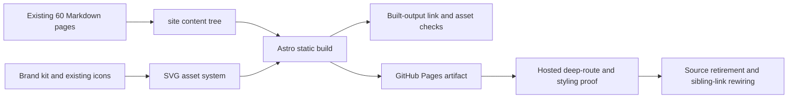

# Modern Railyard Product Site - Plan

## Goal Capsule

- **Objective:** Build a modern Astro marketing and docs site for Railyard in the `railyard` repository, publish it to GitHub Pages at `/railyard`, and prove the hosted product surface before retiring the old org-root source.
- **Authority:** The owner-authorized product-site brief and the repository's delivery, signing, review, and release-coupling instructions govern this plan.
- **Execution profile:** One canonical writer owns `feat/project-pages` in `railyard-site`. Read-only research may run in isolated children. The org-root source remains intact until live migrated-content proof passes.
- **Terminal proof:** The merged PR has settled CI/reviews and a signed merge commit reachable from `main`; the published site returns 200 on the landing page and at least ten deep routes with correct styles, links, and assets; built-output links pass; the old source has a reported final state.
- **Stop conditions:** Stop on signing failure, unresolved required review, failed contract/actionlint checks, destructive-target ambiguity, missing Pages/API authority, or inability to prove the hosted site. Never bypass a signing or safety guard.

---

## Product Contract

### Summary

Railyard becomes a product surface that sells the delivery system first and explains its operating model second. A visitor should understand the promise — say what should change and get back a merged, verified result — then move directly into Start, one of ten outcome scenarios, or the deeper delivery/fleet references.

### Problem Frame

The existing content is strong value-first material in 61 Markdown files, but its Jekyll presentation is a reader surface rather than a product experience. The new site needs stronger hierarchy, a memorable proof moment, responsive visual design, and a docs layout that makes the same content easy to navigate.

The existing source uses root-relative links and assumes an org-root Pages site. The new destination is intentionally a project Pages site at `https://novotnyllc.github.io/railyard/` for the first release. That makes base-path handling a product-critical implementation concern. The custom-domain cutover must reduce to one config-line change, a `CNAME`, and a documented Pages API update rather than a second site rewrite.

### Requirements

#### Product story and visual direction

- **R1.** The landing page presents Railyard as “The delivery system for agent work” and carries the brand promise “Say ‘go do X.’ Get back a merged, verified change — not a claim that it’s done.”
- **R2.** The landing page includes four scannable core promises: ship a change, keep machines current, distribute a skill, and place work with intent.
- **R3.** The landing page includes a terminal-style “one request → one receipt” showpiece, anonymized proof points using counts and OS mix only, and clear CTAs into Start and Scenarios.
- **R4.** The site uses a distinctive industrial/editorial visual direction: signal amber and charcoal from `docs/brand.md`, strong type hierarchy, generous space, restrained rail-diagram motifs, dark/light theme support, responsive layouts, and CSS-only motion that preserves reduced-motion behavior.
- **R5.** Public copy remains value-first, positive-voice, and free of internal history. The private `agent-utilities` identity does not appear in the product story.

#### Content and information architecture

- **R6.** The existing 60 content Markdown pages are migrated or adapted without dropping their substantive value-first content, with ten scenario pages under `what-it-does/`, Start under `start/`, and grouped docs under `delivery/`, `fleet/`, `desired-state/`, `security/`, `integrations/`, and `skills/`.
- **R7.** Docs pages render in a readable docs shell with grouped sidebar navigation, breadcrumbs or section context, previous/next navigation, accessible headings, and internal links that resolve under the configured base path.
- **R8.** Source notes that point to historical `railyard/docs/site/**` or `roundhouse/docs/site/**` paths are refreshed to point to current public or repository sources where the claim needs provenance.
- **R9.** Fleet proof remains anonymized: public claims may include counts and OS mix, but no hostnames, domains, or topology.

#### Build, deploy, and cutover

- **R10.** The site is a static Astro build with no runtime backend and no client framework except Astro islands if a real interaction requires one.
- **R11.** The base path is defined once in a config constant and is `/railyard` for the first release; internal URLs and asset URLs consume that constant rather than scattering the prefix.
- **R12.** GitHub Actions builds the site and deploys the generated artifact through the standard Pages workflow using `actions/deploy-pages`; built output is not committed.
- **R13.** The repository includes a one-commit custom-domain cutover checklist/script that changes the base to `/`, adds `public/CNAME` containing `railyard.express`, updates the site origin, and performs the authorized `gh api` Pages custom-domain PUT after DNS propagation.
- **R14.** Pages is enabled for `novotnyllc/railyard` with build type `workflow`, and the project URL serves the deployed site before the source repository is touched.

#### Assets and quality

- **R15.** The repository contains self-contained SVG assets for the hero rail diagram, scenario icons, and favicon source, plus an OG-share asset at 1200×630 that resolves from the deployed site.
- **R16.** The site includes accessible metadata, favicon links, OG metadata, visible focus states, keyboard navigation, semantic landmarks, reduced-motion support, and a small static payload appropriate for a marketing/docs site.
- **R17.** A built-output link checker catches missing local pages, anchors, assets, and base-path mistakes. Targeted browser/live checks verify at least ten deep routes, styling, internal navigation, favicon, and OG assets.

#### Delivery and retirement

- **R18.** The change remains docs/site/workflow-only and makes no changes under `plugins/**`; no plugin version bump or marketplace repin occurs.
- **R19.** All commits are signed. Signing failure is a hard stop.
- **R20.** The PR receives the required independent review and bot settlement, every real finding is fixed or explicitly recorded, and merge ancestry is proven after merge.
- **R21.** Only after hosted migrated-content proof passes, the old org-root repository is deleted through `gh api` if authorized; otherwise it is reduced to a single pointer README and the owner is told deletion remains.
- **R22.** Cross-references to the old org-root URL in the sibling `railyard`, `roundhouse`, and `marketplace` checkouts are updated to the new URL while preserving unrelated working-tree changes.

### Success Criteria

- A cold visitor can identify the product promise and reach Start or Scenarios from the first screen.
- The built output contains the complete planned public page tree and no broken internal links or asset references.
- The Pages workflow and actionlint gate pass, and the public project URL serves the new design.
- Ten or more deep routes return HTTP 200 with the expected CSS, navigation, and base-prefixed links.
- The merged PR, signed commit evidence, review settlement, ancestry proof, link-check receipt, live-route receipt, and old-source outcome are all reportable.

### Scope Boundaries

**In scope:** Astro site source, content adaptation, layouts, CSS, self-contained visual assets, package lockfile, Pages workflow, Pages configuration, cutover checklist/script, build/link/live verification, cross-reference updates, and post-live old-source retirement.

#### Deferred to Follow-Up Work

- Bespoke raster illustration or commissioned art direction beyond the SVG system.
- External search service or runtime search backend. Build-time Pagefind may be added only if it remains a small, static, useful addition after the docs shell works.
- Any product/plugin behavior change or version bump.
- Any X/social posting.

**Outside this product identity:** runtime backend services, authentication flows, analytics dashboards, private fleet details, and public exposure of `agent-utilities`.

---

## Planning Contract

### Key Technical Decisions

- **KTD1 — Astro static output in `site/`.** *(session-settled: user-directed — chosen over Jekyll and other wiki-first approaches: the owner explicitly requires a modern marketing site with a build step and sanctioned Actions deployment.)* Use Astro with static output, server-rendered HTML at build time, and no runtime framework dependency. This owns R10 and the site implementation boundary.
- **KTD2 — One `BASE_PATH` source of truth.** *(session-settled: user-directed — chosen over scattered project-prefix edits: the custom-domain cutover must be a one-line base change plus `CNAME`.)* Keep the GitHub project Pages base in one config constant and expose one URL helper for page/asset links. This owns R11 and makes R13 testable.
- **KTD3 — Markdown remains the content source format.** *(session-settled: user-directed — chosen over rewriting the copy into a new content model: the existing value-first copy is good and the requested work is presentation and information design.)* Copy the source Markdown into the site content tree, normalize only front matter/provenance/links, and render it through shared Astro components. This owns R6 and reduces copy drift during the rebuild.
- **KTD4 — Shared shell, explicit landing variant.** Use one site chrome for global navigation and docs context, with a dedicated landing composition for the sale narrative. Do not introduce a component library or client state layer for static content. This keeps the UI distinctive while limiting long-term surface area.
- **KTD5 — SVG-first rail identity.** Create the hero diagram, scenario icon set, favicon source, and OG composition as committed SVG assets using the brand palette and uniform geometry. Generate or commit a 1200×630 OG asset in a deterministic way. Record which elements would benefit from later bespoke raster art. This owns R15.
- **KTD6 — Build-time link proof plus hosted deep-route proof.** A local checker validates generated HTML and static asset references; a separate live receipt validates Pages behavior. Neither a green build nor a single landing-page request substitutes for the other. This owns R17 and the delivery terminal evidence.
- **KTD7 — Source retirement follows live proof.** Keep the org-root backup clone untouched and the source repository intact while the project Pages site is built and hosted content is checked. Only then perform the authorized delete-or-pointer action and update sibling-repo links. This owns R21 and the data-loss boundary.
- **KTD8 — Preserve unrelated work and release coupling.** Stage only site/docs/workflow/cross-reference paths. Because no `plugins/**` file changes, do not bump the plugin version or repin marketplace metadata. This owns R18 and the clean-state proof.

### High-Level Technical Design

The site has three layers: a single Astro config and URL helper, shared visual/layout components, and Markdown-backed routes. The config supplies the site origin, `BASE_PATH`, and trailing-slash policy. The URL helper joins that base to page and public asset paths. The layout renders metadata, theme tokens, global navigation, and docs navigation. The landing page composes the product story and receipt showpiece. Docs routes reuse the same content renderer with section metadata, sidebar groups, and prev/next relationships.



The custom-domain cutover is a deliberately separate post-publish operation. It changes the one base constant, adds `public/CNAME`, updates the origin, and uses `gh api` only after DNS propagation is observed. It does not rewrite the migrated Markdown tree.

### Assumptions

- The current GitHub CLI authentication and signing integration may drift between preflight and delivery; the run must re-check both before mutation.
- The project Pages API may return 404 before Pages is enabled; that is a capability state, not proof that the repository is invalid.
- Astro’s current package metadata requires Node 22.12+ and a committed lockfile; the repository’s existing Node 24 Actions convention is sufficient for CI.
- A CSS-only theme toggle can be implemented without an island; if the design can use `prefers-color-scheme` alone, user-controlled theme state remains deferred.

### Dependencies and sequencing

1. Confirm the clean worktree, backup clone, source content, brand tokens, remote, Pages/auth/signing capability, and current cross-reference inventory.
2. Add the minimum Astro scaffold, base-path helper, content/layout shell, and static asset system.
3. Migrate/adapt the Markdown tree and build the landing page, Start path, scenarios, and docs navigation.
4. Add workflow, Pages configuration instructions, cutover checklist/script, and built-output checks.
5. Run focused local build/link/accessibility checks, then the complete site gate and actionlint before commit.
6. Run independent review, fix the whole finding batch, create the signed PR, and settle CI/bot reviews.
7. Merge, prove ancestry, configure Pages if not already configured, and prove hosted routes/assets.
8. Preserve the backup, retire or pointer the old org-root only after hosted proof, then update sibling cross-references and prove the final state.

### Sources and repository patterns

- `docs/brand.md` — authoritative palette, rail-place naming, taglines, icon construction, and positive voice.
- `docs/assets/railyard.png` and `plugins/railyard/assets/icon.png` — existing visual references and favicon source candidates.
- `novotnyllc.github.io/index.md` — landing promise, four promises, receipt showpiece, Start CTAs, and public path.
- `novotnyllc.github.io/what-it-does/*.md` — ten scenario page shape and proof-point content.
- `novotnyllc.github.io/{start,delivery,fleet,desired-state,security,integrations,skills,credits,docs}` — source page tree and docs relationships.
- `novotnyllc.github.io/scripts/check-links.py` — source checker pattern to adapt for generated output; it currently reports 61 Markdown files and no unresolved internal source links.
- `.github/workflows/validate.yml` — current pinned Actions style, Node 24 convention, and actionlint gate requirement.
- `AGENTS.md` and `docs/agents/release-coupling.md` — signed delivery, unrelated-change preservation, and docs-only release boundary.
- Official Astro GitHub Pages documentation — `base` prefixes internal links for project Pages, `public/CNAME` and no `base` are used at custom-domain cutover, and Actions deploys the static artifact.

---

## Implementation Units

### U1. Astro scaffold and URL contract

- **Goal:** Establish a minimal static Astro project under `site/` with one base-path constant, a shared URL helper, metadata defaults, and a committed package lockfile.
- **Files:** `site/package.json`, `site/package-lock.json`, `site/astro.config.mjs`, `site/src/config/site.ts`, `site/src/lib/urls.ts`, `site/src/pages/index.astro`, `site/src/styles/tokens.css`.
- **Patterns:** Use Astro static output and native CSS. Keep the base path in the config module and ensure page/asset URLs use the helper. Keep the component surface small.
- **Test scenarios:** Build with `BASE_PATH=/railyard` and verify generated links/assets begin with `/railyard`; build with the cutover value `/` and verify the same source emits root links without rewriting page content; assert the config rejects or normalizes an accidental doubled slash.
- **Verification:** A fresh install/build creates `site/dist` and no runtime adapter; a small URL-contract check fails if a new hard-coded `/railyard` prefix appears outside the config/helper allowlist.

### U2. Shared chrome and product visual system

- **Goal:** Create the responsive marketing/docs shell, typography, light/dark theme treatment, accessible navigation, code/receipt styling, focus states, and reduced-motion behavior.
- **Files:** `site/src/layouts/SiteLayout.astro`, `site/src/layouts/DocsLayout.astro`, `site/src/components/SiteHeader.astro`, `site/src/components/DocsSidebar.astro`, `site/src/components/PrevNext.astro`, `site/src/components/ThemeToggle.astro` if needed, `site/src/styles/global.css`, `site/src/styles/components.css`.
- **Patterns:** Follow the brand kit’s charcoal/amber/rust palette and geometric rail language. Use semantic landmarks and CSS media queries before client JavaScript. Use one restrained page-load reveal and disable it under `prefers-reduced-motion: reduce`.
- **Test scenarios:** Render a docs page at narrow and wide viewport widths and verify nav remains keyboard reachable; tab through header/sidebar/buttons and verify visible focus; emulate dark scheme and reduced motion and verify contrast/theme/reveal behavior; verify sidebar links and prev/next links use the URL helper.
- **Verification:** Browser or static HTML checks confirm one `main`, a labeled navigation region, a single h1 per page, skip link, focus-visible styles, and no external font CDN requests.

### U3. Branded SVG asset inventory

- **Goal:** Add the self-contained rail-diagram motif, ten scenario icons, favicon set, and OG-share image required by the product presentation.
- **Files:** `site/public/assets/hero-rail.svg`, `site/public/assets/scenarios/*.svg`, `site/public/favicon.svg`, `site/public/favicon-32.png` if a raster favicon is required by browser compatibility, `site/public/og/railyard-og.svg` or deterministic generated PNG, `site/public/og/railyard-og.png` if committed, and an asset inventory note in `site/README.md` or `docs/site-assets.md`.
- **Patterns:** Use charcoal outlines, signal amber accent, white/ink grounds, uniform stroke widths, no text in icons, and simple geometric subjects. Reuse the existing 512px/1024px icon references as visual guidance without making the detailed raster image the only critical asset.
- **Test scenarios:** Validate every SVG parses and has a viewBox; verify the ten scenario icon filenames match the scenario slugs; verify OG output is 1200×630; verify favicons and OG paths appear in built HTML and resolve under both base modes.
- **Verification:** Asset dimensions, SVG parse, and built-reference checks pass. Report hero/scenario icon/OG work as created SVG art and identify later bespoke raster candidates: the hero illustration, OG composition, and any scenario art that later needs richer narrative detail.

### U4. Content migration and landing composition

- **Goal:** Bring the existing value-first copy into Astro content routes and make the landing page a modern product sale with the receipt showpiece and proof points.
- **Files:** `site/src/content/pages/**` or the chosen Markdown content tree; `site/src/pages/index.astro`; `site/src/components/Hero.astro`; `site/src/components/PromiseGrid.astro`; `site/src/components/ReceiptShowcase.astro`; `site/src/components/ProofStrip.astro`; `site/src/components/ScenarioCard.astro`.
- **Patterns:** Preserve substantive copy from the source repo. Adapt front matter and links only as needed. Keep the four promises and ten scenario links visible. Keep proof counts anonymized and retain positive voice. Do not copy private `agent-utilities` material.
- **Test scenarios:** Build all ten scenario routes and verify each has a value-first opening, easy path, mechanism, proof point, and next link; verify the landing page contains four promise links, Start and Scenarios CTAs, receipt steps, and only anonymized fleet proof; grep generated content for the private identity and historical source URLs.
- **Verification:** Content inventory equals the intended source tree; generated page count and route manifest are recorded; visual review checks the landing page at desktop and mobile widths.

### U5. Docs IA, Markdown renderer, and navigation graph

- **Goal:** Render Start, scenarios, delivery, fleet, desired-state, security, integrations, skills, credits, and cutover pages in a grouped docs system with working prev/next navigation.
- **Files:** `site/src/pages/[...slug].astro` or equivalent route generator, `site/src/content/config.ts` if schema validation is used, `site/src/data/navigation.ts`, `site/src/components/MarkdownPage.astro`, `site/src/components/DocsToc.astro`, copied/adapted content paths under `site/src/content/`.
- **Patterns:** Preserve the source tree’s URL slugs. Group sidebar navigation by job: Start, Scenarios, Delivery, Fleet and Desired State, Integrations, Reference and Security. Generate prev/next from the ordered route inventory. Normalize source-root links through the URL helper.
- **Test scenarios:** Verify every planned Markdown source produces one route; verify every internal link resolves to a generated route or anchor; verify first/last pages omit invalid prev/next links; verify cutover instructions are reachable from Start or the site footer; verify source notes do not claim deleted historical paths.
- **Verification:** Generated-output link checker passes with zero local-page, anchor, or asset errors; a route inventory receipt lists all pages and navigation groups.

### U6. Pages workflow, cutover handoff, and local quality gates

- **Goal:** Build and deploy the static site through GitHub Actions, document custom-domain cutover, and make the local checks reproduce the workflow’s essential proof.
- **Files:** `.github/workflows/deploy-pages.yml`, `.github/workflows/validate.yml`, `site/scripts/check-links.mjs` or `scripts/check-site.mjs`, `site/scripts/check-routes.mjs`, `docs/site-cutover.md`, `site/public/robots.txt` if needed.
- **Patterns:** Use pinned action references consistent with the existing workflow. Give the deploy job `contents: read`, `pages: write`, and `id-token: write`; upload the Astro `dist` artifact and deploy with `actions/deploy-pages`. Keep validation separate from deployment. Use `actionlint` before commit.
- **Test scenarios:** Run actionlint against every workflow; run the local install/build/link/routing checks; verify `dist` is ignored and absent from the staged diff; verify the cutover checklist changes only the base constant, origin/CNAME, and Pages custom-domain setting; verify the workflow deploys from `main` and supports manual dispatch.
- **Verification:** Actionlint exits 0, local site gates exit 0, and workflow YAML remains syntactically and semantically valid. Pages API preflight/configuration is recorded separately from local build proof.

### U7. Cross-reference update and guarded source retirement

- **Goal:** After live hosted proof, update old org-root links in the named sibling repos and delete or pointer the old org-root repository according to the authorized API result.
- **Files:** the sibling `railyard/README.md`, `railyard/docs/guide.md`, `railyard/docs/agents/charter.md`, `railyard/THIRD-PARTY-NOTICES.md`, `roundhouse/README.md`, `roundhouse/docs/guide.md`, `roundhouse/docs/agents/charter.md`, `roundhouse/THIRD-PARTY-NOTICES.md`, `marketplace/README.md`, plus the org-root source repo via `gh api`.
- **Patterns:** Refresh the required backup clone before any source mutation. Re-scan all three named repos before editing. Preserve unrelated changes and stage only URL updates. Perform the org-root action only after the live proof receipt is captured.
- **Test scenarios:** With live proof absent, the retirement step refuses to run; with live proof present, old URL grep returns no stale references in the named scopes except intentional historical records; a delete-capable token produces a deleted repo response; otherwise the source contains only a pointer README naming the new site and the report calls out owner deletion.
- **Verification:** Backup SHA and status are recorded; cross-reference diffs are reviewable; API response, final repo state, and post-action URL checks are captured. This unit runs only after U6 hosted proof and merge ancestry.

### U8. Delivery review, signed merge, and post-merge proof

- **Goal:** Carry the complete site change through local review, signed commit, PR settlement, merge, and post-merge public proof.
- **Files:** All changed site/workflow/docs paths; no `plugins/**` paths.
- **Patterns:** Use the unchanged delivery workflow and its review/settlement gates. Run the smallest affected checks after each relevant fix batch. Use signed commits and stop on signer failure. Let the delivery tail own PR watch, thread resolution, merge, and ancestry proof.
- **Test scenarios:** A staged site passes local build/link/asset/route checks and actionlint; a deliberately missing internal route is caught by the checker; a signer failure stops before push; a PR with pending bot review remains unmerged until settlement; a merged PR’s SHA is an ancestor of `origin/main` and its deployed workflow completes.
- **Verification:** Record check commands with unmasked exits, review findings and replies/resolutions, PR state, merge SHA, ancestry result, Pages workflow run, live route matrix, and final clean-state evidence.

---

## Verification Contract

| Gate | Applies to | Evidence | Done signal |
| --- | --- | --- | --- |
| Content and route inventory | U4-U5 | Source-to-generated route map | All intended public pages have one generated route |
| Static build | U1-U6 | Node/ npm install and Astro build receipt | `site/dist` generated; no runtime adapter; exit 0 |
| URL/base contract | U1, U5-U6 | Builds under `/railyard` and `/` plus hard-coded-prefix sweep | Links and assets use the selected mode correctly |
| SVG/OG/favicon assets | U3-U5 | Parse/dimension/reference receipt | All named assets exist and resolve from built HTML |
| Generated link check | U5-U6 | Local checker output | Zero missing pages, anchors, or assets |
| Accessibility/static quality | U2, U4-U5 | HTML checks plus focused browser review | Landmarks, headings, focus, keyboard, theme, reduced motion pass |
| Workflow lint | U6 | `actionlint .github/workflows/*.yml` with direct exit | Exit 0 |
| Repository contract suite | U6/U8 | Existing Node 24 contract tests, run only if changed inputs require them | Existing contracts remain green; plugin manifests unchanged |
| PR review settlement | U8 | PR review/check/thread receipts | Required checks green, Copilot/Codex review wait completed, threads settled |
| Signed Git | U8 | `git log --show-signature` for new commits | All new commits verify; signer failure is a stop |
| Pages configuration | U6/U8 | `gh api` Pages GET/PUT response | Workflow build type configured |
| Live hosted site | U6-U8 | `curl`/browser matrix for landing plus 10+ deep routes, CSS, internal links, favicon, OG | HTTP 200 and expected styling/assets on every sampled route |
| Retirement and cross-references | U7 | Backup SHA, API response, grep/diff, final repo state | Old source deleted or pointer-only; stale URLs resolved; outcome reported |
| Merge ancestry and post-merge | U8 | PR merge JSON, `git merge-base`, post-merge build/link/live check | Merge SHA is reachable from `origin/main` and post-merge proof passes |

### Minimal local receipt set

- `npm ci` or the package-manager command selected by the committed lockfile inside `site/`.
- `npm run build` inside `site/`.
- The generated-output link/asset/route checker.
- `actionlint .github/workflows/*.yml`.
- A focused static HTML/accessibility check and a local preview smoke pass.
- The existing repository contract suite only when the changed workflow/repo inputs make it applicable; no plugin version or manifest changes are expected.

### Hosted receipt set

- Pages API configuration response and workflow run URL/status.
- HTTP status matrix for `/railyard/` plus at least ten routes spanning Start, Scenarios, Delivery, Fleet, Integrations, and Reference.
- One route inspection proving stylesheet and asset URLs are base-prefixed and load successfully.
- Favicon, OG SVG/PNG, and CNAME/cutover artifact checks.
- Post-merge repeat of the smallest public proof after the merge SHA is on `main`.

---

## Definition of Done

- [ ] Astro site source, content, docs shell, and branded assets are present under the target repo with no built output committed.
- [ ] Landing page sells the product, shows four promises, receipt proof, anonymized proof points, and Start/Scenarios CTAs.
- [ ] Ten scenarios and the complete grouped docs/reference tree build with working base-prefixed links and prev/next navigation.
- [ ] Light/dark support, responsive mobile layout, keyboard focus, semantic landmarks, reduced-motion behavior, favicon, and OG metadata are verified.
- [ ] `BASE_PATH` is a single config constant, `/railyard` is the current mode, and the cutover handoff documents the exact one-line/CNAME/Pages API sequence.
- [ ] Pages workflow builds/deploys through Actions and passes actionlint; `dist` is not committed.
- [ ] Local build, generated-output link check, asset checks, and applicable repository gates pass with direct exits.
- [ ] Signed commit/PR review/CI settlement is complete; every real review thread is replied to and resolved.
- [ ] PR merge SHA and ancestry are proven; hosted project Pages returns 200 on at least ten deep routes with correct styling and assets.
- [ ] The required backup clone remains available; only after hosted proof, the old org-root repository is deleted or pointer-reduced and the final end state is reported.
- [ ] Cross-references in the named sibling repos point to the new public URL, unrelated working-tree changes are preserved, and the final worktree/remote state is clean or explicitly explained.

---

## Appendix

### Expected page tree

```text
/
├── start/
│   ├── install/
│   ├── first-delivery/
│   └── first-machine/
├── what-it-does/
│   ├── ship-a-change/
│   ├── harden-review/
│   ├── keep-machines-current/
│   ├── distribute-a-skill/
│   ├── declare-desired-state/
│   ├── work-across-harnesses/
│   ├── ios-and-mac-apps/
│   ├── run-work-on-another-machine/
│   ├── administer-remotely/
│   └── control-model-cost/
├── delivery/            # lifecycle, routing, gates, audit
├── fleet/               # store, convergence, trust, operating, config, why-jj
├── desired-state/       # index, in-fleet, scaling
├── integrations/        # chezmoi, Tart, 1Password, UniFi, Tailscale SSH
├── skills/              # grouped job-oriented references
├── security/            # index, threat model
├── credits/
└── docs/cutover/
```

### Asset inventory handoff

The first release creates a coherent SVG system for the hero rail diagram, ten scenario symbols, favicon source, and OG share composition. Later bespoke raster art would add the most value to the hero illustration and OG card, followed by any scenario whose story benefits from a richer editorial image. The site must remain fully understandable and branded when those future raster assets are absent.
