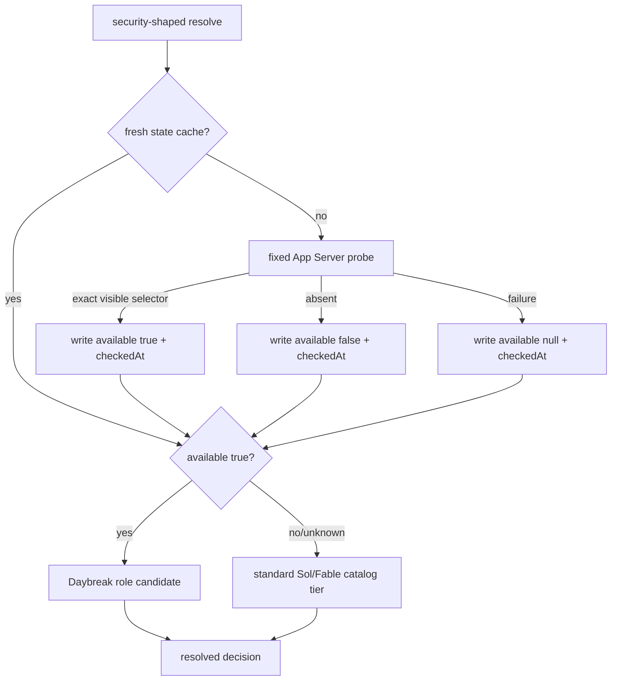

# feat: Route defensive work to available Daybreak Blue and bound Luna

**Target repo:** `novotnyllc/railyard`. All paths below are railyard-relative.

## Goal Capsule

**Objective.** The installed model router detects whether the local Codex
surface exposes `gpt-daybreak-blue-latest`, caches that entitlement for 24
hours in its validated state document, and preferentially routes defensive
security roles to it while preserving the established Sol/Fable fallbacks.
The catalog and doctrine also make Luna's bounded, supervised sub-agent role
structural and clear.

**Authority hierarchy.** Direct owner requirements and verified field reports
outrank repository convention; OpenAI primary documentation grounds only the
public Daybreak descriptions and native Codex behavior. The router must not
invent availability, use caller-provided runtime facts, or silently widen an
account's access.

**Stop conditions.** Stop rather than bypass if signed commits cannot be made,
the post-PR review/settlement gate refuses merge, the marketplace cannot accept
the required direct-main repin, or the app-server's actual `model/list`
surface cannot be probed through its fixed, bounded implementation.

**Execution profile.** One integration branch and worktree, one canonical
writer, Node standard-library implementation only. The state cache and the
owner catalog are consumer-facing state; update the latter only through the
documented install step after the repository source and tests are ready.

**Tail ownership.** This lane owns PR creation, review settlement, squash
merge, marketplace repin, installed-byte verification, local reload, and the
required live route proofs.

---

## Product Contract

### Summary

Railyard currently knows Luna, Terra, Sol, and external carriers, but cannot
recognize the owner-provisioned Daybreak Blue Codex selector or distinguish
Luna's now-confirmed fork support from a coordination role. As a result it
cannot prefer the approved defensive-security surface when it is actually
available, and its doctrine underspecifies the supervision boundary for the
economical worker tier.

This change adds one narrow local discovery fact to the existing model-routing
state: the authenticated local Codex App Server's `model/list` response says
whether the exact owner-supplied selector is available. It remains an
availability signal, not live-carrier proof. Security work uses it only as a
preference; absence, staleness, or probe failure falls through to the existing
configured standard tiers without interrupting ordinary work.

### Requirements

- **R1.** The Codex roster names Sol, Terra, Luna, Daybreak Blue, and GPT-5.5
  with their supplied roles; it describes inherited parent model behavior when
  a native sub-agent model is omitted.
- **R2.** Luna is documented positively as the economical, fork-capable pure
  sub-agent for complete, narrow implementation briefs under stronger
  supervision; it is not eligible for coordinator, reviewer-of-record,
  judgment, or multi-agent coordination roles.
- **R3.** The resolver's Daybreak detector uses the inspected native Codex App
  Server `model/list` method (after `initialize`), exact-matches the
  non-hidden `gpt-daybreak-blue-latest` entry, and has an injectable/fakeable
  probe seam for tests.
- **R4.** The state path safely stores a bounded Daybreak cache with
  `available` and `checkedAt`; positive, negative, and unknown outcomes are
  honored for 24 hours and no caller JSON can supply or overwrite the fact.
- **R5.** A stale cache re-probes; a failed probe records unknown, does not
  throw, does not claim availability, and routes standard tiers without
  repeatedly spawning a probe during the same TTL.
- **R6.** When the cache says available, security review, threat-model,
  trust/redaction/signing, attack-shape, and security-audit roles prefer
  Daybreak Blue before Sol. When it is unavailable or unknown, each role
  selects its catalog fallback without user-facing availability warnings.
- **R7.** The catalog can represent Daybreak's fixed carrier/model and
  security-role mapping. Luna cannot win a coordinator role even if a catalog
  tier attempts to nominate it; a valid stronger fallback remains selectable.
- **R8.** Documentation accurately separates the owner/runtime selector
  `gpt-daybreak-blue-latest` from OpenAI's public `daybreak-blue-latest` name,
  describes separate approval/provisioning, and avoids unverified claims.
- **R9.** The owner-installed `~/.config/railyard/model-routing.json` is
  installed from the repository example and byte-identical to it after the
  update; it maps defensive roles to Daybreak when available and retains the
  Luna eligibility annotations.
- **R10.** All changed plugin manifests move in lockstep to `0.8.1`; the
  repository's full contract suite, live local resolver proofs, signed PR,
  review settlement, merge ancestry, marketplace repin, and reloaded harness
  proof complete one delivery.

### Acceptance Examples

- **AE1.** A fake fresh positive App Server response and a `security.review`
  request select `gpt-daybreak-blue-latest`.
- **AE2.** A fresh negative response for the same role selects its configured
  Sol or Fable fallback and emits no availability error.
- **AE3.** An expired cache invokes the fake probe exactly once and replaces
  the old record; a fresh cache invokes it zero times.
- **AE4.** A malformed, timed-out, nonzero, or JSON-RPC-error probe becomes
  unknown, persists the bounded retry stamp, selects the standard route, and
  never crashes the resolver.
- **AE5.** A catalog that attempts Luna first for `orchestration` rejects it
  as role-ineligible and selects Sol; the same Luna model remains eligible for
  a fully specified implementation role.
- **AE6.** The local App Server proof on the owner's machine discovers
  `gpt-daybreak-blue-latest`, then a security-role resolver proof selects it;
  a non-security route is unchanged.

### Scope Boundaries

**In scope:** the resolver/carrier/state/catalog surfaces, focused contract
tests, two model-routing references, example catalog, plugin manifests,
installed owner catalog, marketplace repin, and delivery evidence.

**Out of scope:** changing OpenAI entitlement, treating model listing as a
successful defensive-task canary, exposing user-configurable commands or
endpoints, altering nonsecurity routing precedence, or adding a generic
provider-discovery framework.

---

## Planning Contract

### Key Technical Decisions

- **KTD1 — Use the native App Server, not a guessed CLI command.** *(owner-
  directed)* The fixed probe starts the canonical Codex binary with
  `app-server --stdio`, sends `initialize`, then JSON-RPC `model/list`, and
  inspects only the bounded model facts needed for the exact Daybreak selector.
  This follows the inspected local surface and avoids a shell command or
  caller-provided executable. Governs R3–R5.

- **KTD2 — Store availability in the existing validated state document.**
  *(owner-directed)* Add one `daybreakAvailability` record rather than a new
  file or cache service, so existing path validation, private locking, size
  controls, and atomic writes apply. Its `{ available, checkedAt }` shape
  allows `available: null` for an unknown failed probe; all three values share
  the 24-hour cooldown. Governs R4–R5.

- **KTD3 — Probe only security-shaped resolves and only when stale.** A
  nonsecurity route remains read-only and unaffected. A security resolve with
  a fresh cache selects from that fact; a stale cache takes the existing state
  lock, probes once, writes the result, then resolves. Governs R5–R6.

- **KTD4 — Daybreak is a fixed native carrier plus catalog policy, not a Sol
  alias.** The owner-supplied Codex selector is distinct from Sol in the local
  model list, so it gets a fixed carrier and an explicit catalog model. Its
  public API alias relationship is documentation context only and never a
  runtime substitution. Governs R6–R8.

- **KTD5 — Enforce Luna's role boundary where all candidates pass.** Preserve
  the existing model/carrier role eligibility checks and make their behavior
  explicit in tests; a misordered catalog cannot promote Luna into
  orchestration or review. No new "supervisor" runtime abstraction is needed.
  Governs R2 and R7.

- **KTD6 — Fail closed on selection, graceful on entitlement discovery.** A
  positive Daybreak route needs a fresh positive cache; stale/missing/unknown
  evidence rejects that candidate and lets the configured standard fallback
  decide. Probe errors are contained and never block a normal route. Governs
  R4–R6.

### Research Basis

- OpenAI's [Daybreak Blue model documentation](https://developers.openai.com/api/docs/models/daybreak-blue-latest)
  calls the public `daybreak-blue-latest` an approval/provisioning-gated alias
  calibrated for defensive cybersecurity work.
- OpenAI's [Models and Trusted Access guidance](https://learn.chatgpt.com/docs/cyber-safety)
  lists authorized defensive workflows and explains that access depends on
  approved identity, workspace/API organization or project, offering/model,
  and product surface.
- OpenAI's [Codex App Server documentation](https://developers.openai.com/codex/app-server)
  documents `model/list`; the local Codex 0.147.0 App Server confirmed the
  exact method and listed the owner selector on 2026-08-15.
- OpenAI's [Codex subagents documentation](https://developers.openai.com/codex/subagents)
  confirms native sub-agent model precedence, including inheritance from the
  parent when no more-specific setting is provided. Luna's pure-sub-agent,
  non-peer boundary is owner-verified field-report doctrine, not attributed to
  a public OpenAI page.

### High-Level Technical Design

### Implementation Units

#### U1 — Fixed Daybreak carrier and bounded availability state

**Goal.** Make the exact Daybreak selector a valid fixed carrier and persist
only a validated 24-hour entitlement fact.

**Files.**

- Modify `plugins/railyard/scripts/model-routing/registries.mjs`
- Modify `plugins/railyard/scripts/model-routing/state-schema.mjs`
- Add `plugins/railyard/scripts/model-routing/daybreak-availability.mjs`
- Modify `plugins/railyard/scripts/model-routing.mjs`

**Approach.** Add the carrier's native adapters and defensive-only roles.
Extend the strict state schema and empty state with the one cache record.
Implement the stdlib-only, fixed-command App Server JSON-RPC probe with an
injected spawn/probe seam, bounded response handling, timeout cleanup, exact
visible-model matching, and failure-to-unknown conversion. Re-export the
module through the stable entrypoint.

**Test scenarios.** Validate the new state record; accept the fixed model
binding; fake positive/negative/malformed/timeout probe results; assert that
the probe cannot be selected by request JSON and does not retain raw responses.

#### U2 — Resolver preference and Luna guard

**Goal.** Refresh only stale security availability and apply the catalog's
Daybreak-first policy without moving ordinary routes.

**Files.**

- Modify `plugins/railyard/scripts/model-routing/cli.mjs`
- Modify `plugins/railyard/scripts/model-routing/dispatch.mjs`
- Modify `plugins/railyard/scripts/model-routing/select.mjs`
- Modify `plugins/railyard/scripts/model-routing/request.mjs` only if a
  strictly bounded internal command marker is required
- Modify `plugins/railyard/scripts/model-routing.test.mjs`

**Approach.** Reuse the existing safe state-path lock/read/write path for a
security resolve that needs a refresh, then route from the updated state. Make
the fake probe an injected CLI option for tests. Reject Daybreak when the
fresh state is false or unknown so configured fallback tiers remain the sole
fallback mechanism. Assert Luna's existing model/carrier role boundary with a
catalog that attempts an invalid coordinator nomination.

**Test scenarios.** AE1–AE5, including exact once-per-TTL behavior and no
probe for a fresh record or unchanged nonsecurity request. Cover public CLI
and pure embedded dispatch paths so state mutation and selection agree.

#### U3 — Catalog, doctrine, and release-consumer convergence

**Goal.** Express the routing policy in the shipped catalog and give owners
accurate, usable model doctrine.

**Files.**

- Modify `plugins/railyard/references/model-routing.example.json`
- Modify `plugins/railyard/references/model-routing.md`
- Modify `plugins/railyard/references/harness-model-invocation.md`
- Modify `plugins/railyard/.codex-plugin/plugin.json`
- Modify `plugins/railyard/.claude-plugin/plugin.json`

**Approach.** Add Daybreak roles and Sol/Fable fallbacks to the example policy;
annotate Luna's eligible and ineligible role classes, the parent-inheritance
rule, and GPT-5.5's honest placement relative to Sol. Add a short Daybreak
section covering public terminology, defensive routing, 24-hour discovery,
and silent absence. Update both plugin versions to `0.8.1` together.

**Test scenarios.** Parse and validate the shipped example catalog; assert all
listed roles match their fixed carrier support; compare installed owner catalog
bytes with the repository example after the documented install step.

#### U4 — Delivery and installed-state proof

**Goal.** Land the change as a signed, reviewed, reproducible release update.

**Files.**

- Modify the owner-installed `~/.config/railyard/model-routing.json` only via
  the documented catalog installation step
- Modify the marketplace Railyard pin only through its `scripts/repin` helper
  after the merge SHA exists

**Approach.** Run targeted tests during implementation and the required full
contract suite once frozen. Use the local App Server discovery cache through a
live security resolve, then prove a Luna coordinator downgrade and an
unchanged nonsecurity route. Submit one signed PR, settle every review thread,
squash merge, prove ancestry, repin version `0.8.1` to the merge SHA directly
on marketplace main, prove the remote ref and pin, reload both harnesses, and
byte-verify the installed catalog.

**Test scenarios.** The three owner-machine live proofs plus all delivery
receipts in the Definition of Done.

### Dependencies and Sequencing

1. U1 establishes fixed carrier/state/probe invariants.
2. U2 consumes those invariants and proves resolver behavior.
3. U3 makes the validated behavior installable and explainable.
4. U4 runs after the tree is frozen, reviewed, and signed.

### Risks and Mitigations

- **App Server protocol drift:** exact method/response parsing is isolated in
  one small module, bounded by timeout, and failure falls back normally.
- **Entitlement ambiguity:** only exact current machine enumeration can select
  Daybreak; unknown is never promoted to available.
- **State integrity:** the cache lives under the existing validator, private
  lock, atomic write, and size limit rather than a new unconstrained file.
- **Doctrine overreach:** public-source wording is limited to official claims;
  owner facts are identified as owner-verified where appropriate.
- **Release coupling:** manifests, installed bytes, and marketplace pin are
  independently verified after the exact merge SHA is known.

---

## Verification Contract

1. Focused resolver suite: `node --test plugins/railyard/scripts/model-routing.test.mjs`.
2. Required full contract suite from `AGENTS.md` after all changed inputs
   freeze, with the unmasked process exit recorded.
3. Example catalog validation and owner installed-vs-example byte comparison.
4. Local live JSON results retained verbatim for: security Daybreak selection,
   Luna coordinator refusal/downgrade, and unchanged nonsecurity selection.
5. Independent Sol high-or-max code review, PR CI, review-thread settlement,
   signed squash merge, `merge-base --is-ancestor` proof, marketplace repin
   check, `ls-remote` proof, both harness reload receipts, and hook approval
   with zero prompts.

## Definition of Done

- R1–R10 and AE1–AE6 are satisfied by checked-in tests, documentation, and
  live receipts.
- The full contract suite is green on the final source commit.
- One PR is merged with every review thread resolved and no outstanding
  actionable finding.
- Both plugin manifests and the marketplace reference resolve `0.8.1` at the
  merged commit; the installed owner catalog is byte-identical to the shipped
  example.
- The final report includes official research sources, exact detection/cache
  receipts, verbatim live resolver proofs, PR/merge/ancestry/settlement,
  repin/reload evidence, and any deviation from this contract.
