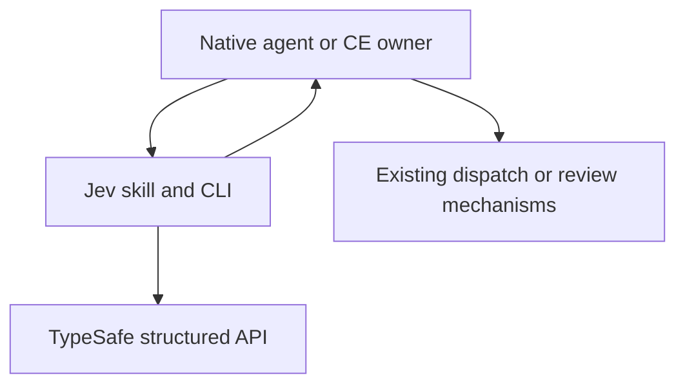
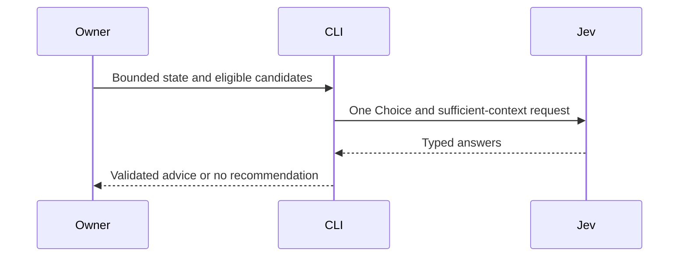
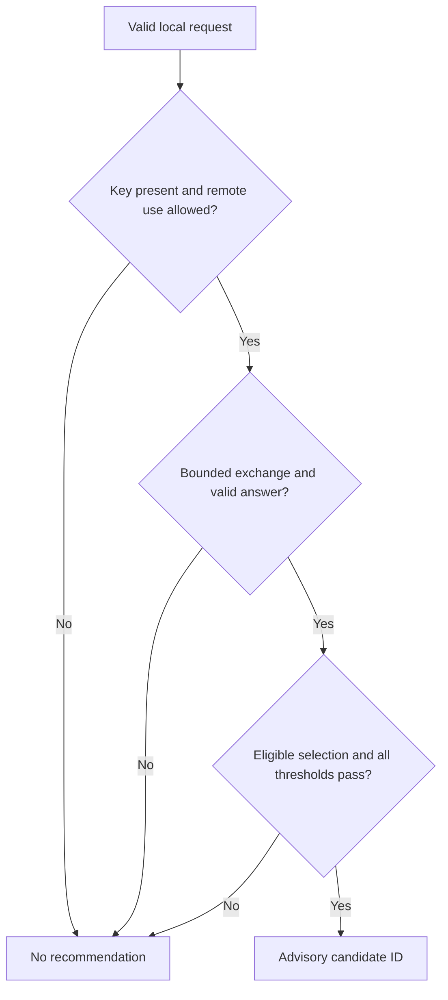
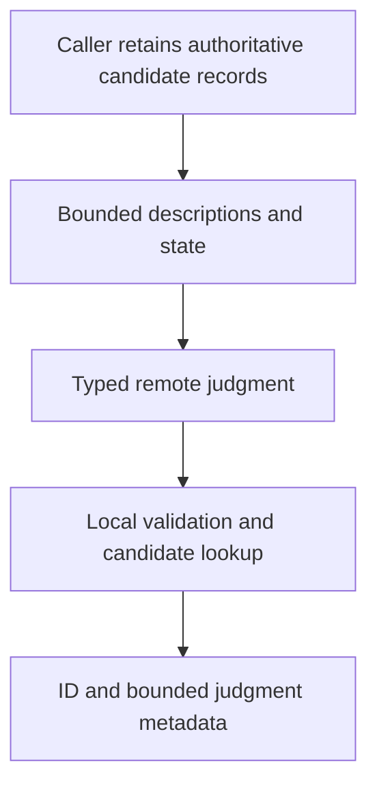

# Jev Semantic Advice - Plan

## Goal Capsule

- **Objective:** Railyard users can obtain useful Jev advice throughout planning, execution, and review when several reasonable next actions remain.
- **Means:** A small `railyard:jev` skill and Node 24 adviser, integrated with existing routing guidance (KTD1, KTD2).
- **Authority:** User and repository constraints govern the Product Contract; technical decisions and units implement it. Existing native and CE owners retain the authority described in R3.
- **Execution profile:** Local implementation, verification, and commits. The implementing owner finishes both units, commits the source, and commits the marketplace version and exact source SHA update requested by the user. Report live API evidence separately from offline evidence.
- **Stop conditions:** Do not push, publish, merge, change fleet configuration, or claim installed delivery under this local implementation request (R7).

---

## Product Contract

### Summary

Add Jev as a semantic adviser for workflow selection, model and reasoning-effort allocation, review investigation, evidence selection, and work priority. Use it by default for meaningful uncertain decisions when `TYPESAFE_API_KEY` is present, with an offline option and the existing task privacy constraints.

### Problem Frame

Railyard already selects workflows and allocations, but those choices can benefit from a structured second opinion when several eligible options remain. Its strict resolver intentionally accepts content-free policy data, while Jev evaluates semantic context. Combining those responsibilities would weaken the resolver's existing admission and authority boundary.

### Key Decisions

- **Use the configured key by default.** (session-settled: user-directed — chosen over an additional per-request opt-in: the user requested default use when `TYPESAFE_API_KEY` exists.) Governs R1.
- **Use advice throughout appropriate work.** The user requested broad appropriate use; direct facts and explicit user choices still bypass semantic judgment. Governs R2.
- **Keep Jev advisory.** Its result informs existing owners and never becomes authority to start or settle work. Governs R3, R4.

### Requirements

**Use and ownership**

- R1. Jev use is enabled by default when a nonblank `TYPESAFE_API_KEY` exists, while `--offline` and applicable user or task privacy restrictions prevent remote use.
- R2. Support workflow, allocation, review-triage, evidence-selection, and work-priority advice over bounded caller-supplied state and eligible candidates; repeat advice when relevant state or options change, rather than on unchanged deterministic steps.
- R3. Preserve explicit user model and effort choices, active native capability constraints, deterministic admission and budget policy, and CE's sole review-settlement ownership.
- R4. Return a recommendation only for an original eligible candidate that passes local validation and judgment thresholds; otherwise return an explicit no-recommendation result and let the existing owner continue.
- R8. For each substantive assignment with an open model-and-effort choice, use Jev allocation advice as the default first selection pass among locally compatible pairs; explicit selections and authoritative fixed roles bypass inference.

**Data and delivery**

- R5. Export only the supplied semantic state and candidate descriptions to the fixed TypeSafe API, without gathering repository files, transcripts, credentials, or machine configuration.
- R6. Bound inputs, remote response consumption, and request duration; keep credentials, semantic state, raw errors, and remote instructions out of output.
- R7. Provide usable instructions for Codex and Claude Code, repository verification, and lockstep local manifest versions. Commit the source and the matching marketplace version and source SHA locally, as requested by the user; publication and installed delivery require a later authorized release.

### Acceptance Examples

- AE1. **Covers R1, R4:** With a key and permitted context, a valid high-confidence response recommends the supplied candidate; with `--offline` or no key, the same request makes no HTTP call and returns no recommendation.
- AE2. **Covers R3, R4:** An allocation request constrained to a user's required candidate cannot produce advice for a different pair, even if a remote answer names it.
- AE3. **Covers R3, R4:** A review-triage recommendation identifies the next investigation; the owning CE workflow still decides whether a finding is settled.
- AE4. **Covers R4, R6:** A timeout, malformed body, unknown candidate, `no_match`, or insufficient context produces no recommendation and no reflected request text.

### Scope Boundaries

The change does not add a Jev provider or carrier to the strict resolver, a generic evaluator API, a new workflow runner, or a network call from startup or per-tool hooks. It does not install an SDK, modify installed plugin caches, or administer hosts.

#### Deferred to Follow-Up Work

Publication and installed-runtime verification remain release work. Before publishing the prepared marketplace pin, verify that its source commit is published and update the pin if the final merge changes the SHA. Workload-specific threshold calibration and efficiency comparisons can follow actual usage; this feature makes no claim that Jev reduces total cost or improves completed-task accuracy.

---

## Planning Contract

### Assumptions

These are unvalidated planning defaults, not claims of user-confirmed product behavior:

- Caller-provided candidates keep the five fixed presets useful without adding a capability catalog or automatic inventory.
- A 10-second request deadline and default thresholds of `0.8` are conservative usability choices, not measured accuracy or calibrated risk levels.
- Explicit choices generally need no semantic advice. `requiredCandidateId` remains available for callers that need a judgment constrained to one existing candidate.
- Current official API examples establish the wire shape. A live smoke, when an authorized key is available, establishes compatibility for the tested request only.

### Key Technical Decisions

- KTD1. **Keep the adviser in `plugins/railyard/skills/jev/`.** Use Node 24 built-ins and a skill-local script, following the repository's install-free runtime convention. The strict resolver's closed request allowlist stays unchanged (R2, R3).
- KTD2. **Use environment presence as availability, without startup inference.** Delivery, allocation, and orchestration instructions use the adviser as a first pass on meaningful uncertain choices and consult it again when relevant state or options change. The allocation owner maps the recommended candidate to its retained model-and-effort pair, rechecks current policy, and dispatches through its existing mechanism (R3, R8). Preserve Astra Max as a baseline candidate where applicable, without hard-coding a cheaper-model ladder or a universal winner. The existing startup charter may print one conditional informational line when a key exists; it must never print the key or contact Jev (R1, R2).
- KTD3. **Use one fixed HTTP exchange.** Send `POST https://api.typesafe.ai/v1/systemone` with Bearer `TYPESAFE_API_KEY`, fixed `model: jev-latest`, supplied `state`, and fixed preset questions. Use one Choice question plus one independent Noul sufficient-context question in that request. Reject redirects, do not retry, and apply the deadline through body consumption. The [official API](https://docs.typesafe.ai/api) supports this structured contract (R5, R6).
- KTD4. **Own the candidate namespace locally.** Input has `mode`, string `state`, `candidates`, optional `requiredCandidateId`, and optional `thresholds`. Reject unknown fields, duplicate IDs, reserved `no_match`, and malformed preset candidates. Add `no_match` locally, and restrict a required candidate before any request (R2, R3).
- KTD5. **Treat provider output as data.** Choice answers contain `type`, `choice`, `probabilities`, and `confidence`; Noul answers contain `type` and `noul`. Validate exact requested IDs and finite numeric ranges, and require the selected candidate to be the unique probability winner. Apply `minConfidence`, `minProbability`, and `minSufficientContext` separately with inclusive `>=` comparisons; all three default to `0.8`. Ties, `no_match`, and insufficient context defer. Confidence is distinct from the selected option's probability and neither is calibrated correctness. The [skill-suggestion recipe](https://docs.typesafe.ai/cookbooks/skill_suggestion) motivates a separate suitability check (R4).
- KTD6. **Return one stable, non-authoritative envelope.** Output schema `railyard/jev-advice/v1` includes `advisoryOnly: true`, `status`, `mode`, static `reason`, `recommendation`, `judgment`, and `provider`. A recommendation contains only the original `candidateId`; the caller resolves it against its retained local candidate record and rechecks current constraints before acting. Provider fields retain only validated model and usage metadata. Invalid caller input or arguments exit 2; optional unavailable/deferred/provider-failure outcomes exit 0 (R3, R4, R6).
- KTD7. **Bound input separately from transport.** Limit input, serialized request, and response to 64 KiB each; state to 16 KiB; each description to 2 KiB; and candidates to 1-16. Candidate IDs use lowercase ASCII letters, digits, underscores, and hyphens, start with a letter, and contain at most 64 characters; reserve `no_match`, `constructor`, `prototype`, and `__proto__`. Allocation model tokens are bounded to 128 characters. A separate 10-second stdin deadline terminates stalled producers with a fixed invalid-input result and no HTTP request. KTD3 owns the subsequent 10-second transport-and-body deadline (R6).

A separate adviser wins over extending the strict resolver because semantic content and third-party calls do not belong in its existing content-free policy boundary. Built-in `fetch` avoids an SDK dependency and permits a narrow injected transport seam. These choices follow established ownership constraints and require no competing implementation prototype.

### High-Level Technical Design

**Components and ownership**

**Request protocol**

**Decision gates**

**Data boundary**

**Interface and mode sketch**

| Surface | Shape or behavior |
|---|---|
| Workflow candidates | `id`, `workflow`, `description`; workflow comes from the fixed supported native/CE set |
| Allocation candidates | `id`, `model`, `reasoning_effort`, `description`; caller attests current eligibility |
| Review candidates | `id`, `description`; each description names an investigation, never a settlement action |
| Evidence candidates | `id`, `description`; each identifies a supplied evidence item, without fetching it |
| Work-priority candidates | `id`, `description`; each identifies a ready bounded subtask or check, without starting it |
| Thresholds | Optional `minConfidence`, `minProbability`, `minSufficientContext`, each within `[0,1]` |
| Remote disabled | `--offline` or missing key returns `unavailable` without HTTP |
| Result states | `recommended`, `deferred`, `unavailable`, or `error`; only `recommended` contains a recommendation |

### System-Wide Impact and Risks

Default availability adds possible latency and data egress only when the owning agent invokes advice. The caller must apply privacy restrictions before invocation; key presence is not permission to export prohibited material (R1, R5). No advice is persisted automatically, and there is no cache or background lifecycle.

Malformed responses and prompt injection can distort judgment but cannot add a candidate or gain execution authority through this interface (KTD4-KTD6). A valid recommendation may still be wrong; existing owners assess it against current evidence. API and model aliases can change, so offline tests and any live smoke must be reported separately.

---

## Implementation Units

### U1. Implement the bounded Jev adviser

**Goal:** Produce useful typed advice and predictable no-advice outcomes.

**Requirements:** R1-R6; AE1-AE4. **Dependencies:** None.

**Files:** Create `plugins/railyard/skills/jev/scripts/jev-adviser.mjs` and `plugins/railyard/skills/jev/scripts/jev-adviser.test.mjs`.

**Approach:**

1. Keep preset construction, input validation, response validation, and result mapping testable independently from the CLI entry point (KTD3-KTD6).
2. Apply KTD7 at the stdin boundary and use an injectable HTTP seam.
3. Make every failure return the same documented envelope without invoking any execution adapter.

**Patterns to follow:** The exportable entry points and dependency-injection patterns in `plugins/railyard/skills/oracle/scripts/oracle-route.mjs` and its test suite. Do not reuse the strict resolver's much narrower semantic string limits.

**Test scenarios:**

1. Covers AE1. Each preset sends its exact expected Choice/Noul contract and maps a successful answer to an original candidate ID.
2. Covers AE1. Key absence, blank key, and `--offline` cause zero HTTP requests.
3. Covers AE2. Required selection is applied before HTTP; an excluded or invented selected ID never becomes advice.
4. Reject unknown keys, invalid modes, empty or oversized state, invalid candidate fields, duplicate/reserved IDs, and out-of-range thresholds before HTTP.
5. Covers AE4. Exercise exact-threshold success, each field below its threshold, `no_match`, ties with lowered thresholds, disagreement between `choice` and the probability winner, malformed probabilities, and answer-type mismatch.
6. Covers AE4. Exercise DNS/fetch failure, authorization failure, rate limit, server failure, redirects, invalid JSON, oversized bodies, and a body that stalls after headers.
7. The CLI returns a single parseable envelope with the documented exit status for invalid input and optional failure paths.
8. Sentinel credentials and state never appear in output, diagnostics, or raw exception messages; hostile response prose cannot become an instruction.
9. Open empty or incomplete stdin terminates within KTD7's deadline with zero HTTP calls; multibyte input crossing a byte limit is rejected. CLI fixtures isolate `TYPESAFE_API_KEY` from the operator's environment.

**Verification:** The new suite passes on Node 24 without a key or internet access. A separately authorized live smoke uses synthetic non-private state and reports actual provider model and structured result without claiming calibration.

### U2. Integrate discoverability, defaults, and release metadata

**Goal:** Make the adviser available in both harnesses and explain how existing owners consume it.

**Requirements:** R1, R3, R7, R8; AE1-AE3. **Dependencies:** U1's public contract.

**Files:**

- Skill surface: `plugins/railyard/skills/jev/SKILL.md`, `plugins/railyard/skills/jev/references/usage.md`, `plugins/railyard/skills/jev/agents/openai.yaml`, `plugins/railyard/skills/deliver/SKILL.md`, `plugins/railyard/skills/model-routing/SKILL.md`, and `plugins/railyard/skills/orchestrate/SKILL.md`.
- Startup guidance: `plugins/railyard/hooks/routing-charter.js` and `plugins/railyard/hooks/routing-charter.test.mjs`.
- Packaging and gates: `plugins/railyard/.codex-plugin/plugin.json`, `plugins/railyard/.claude-plugin/plugin.json`, `.github/workflows/validate.yml`, and `AGENTS.md`.
- Repository documentation: `README.md` and `docs/agents/routing.md`.
- Public documentation: `site/src/content/pages/integrations/index.md`, `site/src/content/pages/skills/index.md`, `site/src/content/pages/skills/jev.md`, `site/src/content/pages/skills/deliver.md`, and `site/src/content/pages/skills/model-routing.md`.

**Approach:**

1. Document exact stdin/output shapes and one synthetic example per preset, with caller eligibility, privacy, offline, and CE-ownership guidance (KTD4-KTD6).
2. Add conditional key-present startup guidance and narrow routing pointers (KTD2), retaining the existing startup output budget.
3. Register `./skills/jev` in the Claude manifest, preserve Codex skill-directory discovery, bump both manifests from `0.9.2` to `0.10.0`, and include the adviser test in CI and `AGENTS.md`.

**Patterns to follow:** `docs/agents/skill-authoring.md`, `docs/agents/routing.md`, `docs/agents/release-coupling.md`, and the existing routing-charter suite.

**Test scenarios:**

1. Covers AE1. Startup includes Jev guidance only for a nonblank key, never exposes the key, never makes an inference request, and stays within its existing size bound.
2. Covers AE2/AE3. Skill instructions preserve explicit allocation choices, require current candidate eligibility, and leave review settlement with the active CE owner.
3. Both manifests parse, agree on `0.10.0`, and expose the skill; the CI and documented suite lists include the same new test.
4. Read back an example where eligibility, an explicit user requirement, or privacy permission changes while advice is pending: the owner discards incompatible advice under KTD6, without dispatching or settling anything.

**Verification:** The documented invocations match U1's tested contract, all skill frontmatter remains valid, and the repository's required Node 24 suites pass. Source-level discovery is not reported as installed-runtime delivery.

---

## Verification Contract

- Run the exact Node 24 contract suites listed in `AGENTS.md`, including `plugins/railyard/skills/jev/scripts/jev-adviser.test.mjs`; preserve parity with `.github/workflows/validate.yml`.
- Parse both plugin manifests as JSON and validate skill YAML frontmatter and names, including `name: jev`.
- Verify startup key detection and privacy of its output through `plugins/railyard/hooks/routing-charter.test.mjs`.
- Read back all five skill examples against the tested CLI contract. Confirm that neither the strict resolver nor default hook manifests gained Jev network behavior.
- If an authorized key is available, perform a synthetic live smoke without storing or printing the key. If unavailable, report live API compatibility as unverified rather than blocking local completion.

---

## Definition of Done

- U1's public contract is implemented and its happy paths, boundaries, and failures pass offline tests.
- U2 exposes `railyard:jev` in both source manifests and documents the key-enabled default accurately.
- Existing native allocation, deterministic routing, and CE settlement regression suites pass.
- Local source and marketplace commits agree on version `0.10.0`, and the marketplace pins the exact source commit through `scripts/repin`; the marketplace consistency check and self-test pass.
- The final report distinguishes source implementation, offline checks, actual live smoke, and the deferred release tail.
- No abandoned implementation, unrelated changes, credentials, or private fixture content remains in the diff.
