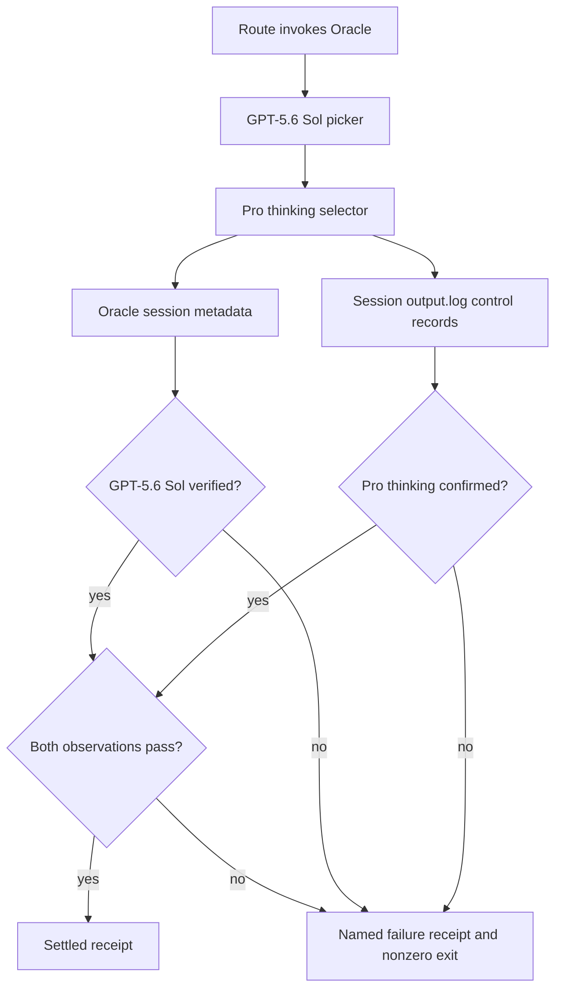

# Oracle Pro Picker Assertion - Plan

## Goal Capsule

- **Objective:** Route browser Oracle reviews to the GPT-5.6 Sol picker with confirmed Pro thinking, then reject any unobserved or downgraded result before it can be accepted as a current-Pro review.
- **Authority:** The installed Oracle 0.17.3 CLI source and its observed browser output govern picker behavior.
- **Release scope:** Ship the plugin as 0.8.2, merge the source PR, repin the marketplace, reload both local harnesses, and record one bounded browser proof.
- **Stop conditions:** Stop the live proof on login, account-selection, picker absence, or any explicit refusal.

---

## Product Contract

### Summary

The current `gpt-5-pro` browser alias is not a latest-Pro selector in Oracle 0.17.3.
The supported browser path is `gpt-5.6-sol` plus `--browser-thinking-time pro`.
The plugin must prove the session selected GPT-5.6 Sol and confirmed Pro thinking before it treats a review as valid.

### Problem Frame

Oracle normalizes `gpt-5-pro` to `gpt-5.5-pro` and targets the `GPT-5.5` picker label.
The previous skill wording therefore allowed a GPT-5.5 browser result to be described as GPT-5.6 Sol Pro.

### Requirements

**Picker selection**

- R1. Routed browser reviews require Oracle `>=0.17.3` and invoke it with `gpt-5.6-sol` and `--browser-thinking-time pro`.
- R2. The manual browser-Pro guidance uses the same model and Pro-thinking combination.

**Observed-model guard**

- R3. A successful routed run reads its Oracle session metadata and requires verified `GPT-5.6 Sol` model-selection evidence.
- R4. A successful routed run requires exactly one `[browser] Thinking time: Pro` control record in the pre-`Answer:` portion of the route-owned Oracle session log.
- R5. A missing, unverified, or mismatched model or Pro-thinking observation becomes a named failing receipt outcome and a nonzero route CLI result, after the receipt has been serialized.

**Release integrity**

- R6. The plugin manifests move together to 0.8.2 and all affected route and model-routing tests pass.
- R7. The merged source SHA is repinned through the marketplace’s `scripts/repin` command and verified after local reload.

### Acceptance Examples

- AE1. Covers R1-R4. Given Oracle reports `resolvedLabel=GPT-5.6 Sol`, `verified=yes`, and one pre-answer `[browser] Thinking time: Pro` control record, the route emits a settled receipt with observed model `gpt-5.6-sol`.
- AE2. Covers R3-R5. Given session metadata reports `GPT-5.5`, the route persists `oracle_observed_model_mismatch`, records no positive capability, records an `unsupported` negative capability after reconciliation, and exits nonzero when invoked as its CLI.
- AE3. Covers R3-R5. Given metadata is absent, the pre-answer control record is absent or duplicated, or only the rendered answer contains the marker, the route returns a named observation failure instead of a successful review.

### Scope Boundaries

- Keep the Oracle CLI installed version unchanged.
- Do not alter personal Oracle configuration, authentication, browser profiles, or stored sessions outside the bounded proof session.
- Do not claim that the CLI can enumerate or select a future unnamed Pro picker label.

### Sources / Research

- Oracle 0.17.3 `dist/src/cli/browserConfig.js` maps `gpt-5-pro` to `gpt-5.5-pro`, maps `gpt-5.6-sol` to `GPT-5.6 Sol`, and enables the browser thinking-time control.
- Oracle 0.17.3 `dist/src/browser/actions/thinkingTime.js` makes an explicit `pro` request fail closed when ChatGPT cannot confirm it.
- The supplied Oracle narrative log reports `target=GPT-5.5; requested=gpt-5-pro` and `GPT-5.5[browser]` for the stale path.

---

## Planning Contract

### Key Technical Decisions

- KTD1. **Use the supported GPT-5.6 picker plus Pro effort.** Require Oracle 0.17.3 or newer: that validated browser CLI accepts `gpt-5.6-sol` and `--browser-thinking-time pro`; `gpt-5.6-pro` is rejected as an API-only reasoning mode. Governs R1, R2.
- KTD2. **Require two session-bound observations.** An allowlisted `browser.modelSelection` object in private session metadata proves the selected GPT-5.6 model label. A bounded read of that same session's private `output.log` proves the separate Pro-thinking selection only when exactly one anchored `[browser] Thinking time: Pro` record occurs before the first `Answer:` boundary. Neither raw metadata nor raw Oracle output is copied into a receipt. Governs R3, R4, R5.
- KTD3. **Persist a failure receipt and make the route process fail.** The direct CLI serializes the durable failure receipt, then sets `process.exitCode = 1`; a caller can reconcile the evidence while shell automation still fails loudly. Governs R5.

### High-Level Technical Design

### Assumptions

- Oracle’s stable session metadata continues to expose `browser.modelSelection` for browser sessions.
- Oracle’s session `output.log` continues to retain the control record before the rendered answer; a format change is a named, fail-closed observation failure.
- The current ChatGPT Pro surface identifies the selected model as `GPT-5.6 Sol` and its highest effort as `Pro`.

### Risks & Dependencies

- A ChatGPT picker label, effort control, metadata, or session-log format change will fail closed and require an intentional update rather than silently accepting a different model.
- The live proof depends on the signed-in account exposing the GPT-5.6 Pro effort.

---

## Implementation Units

### U1. Route current-Pro selection and observation guard

- **Goal:** Replace the stale alias with the supported GPT-5.6-plus-Pro browser invocation and reject unproven observations.
- **Requirements:** R1, R3, R4, R5; KTD1, KTD2, KTD3.
- **Dependencies:** None.
- **Files:** `plugins/railyard/skills/oracle/scripts/oracle-route.mjs`, `plugins/railyard/skills/oracle/scripts/oracle-observation.mjs`, `plugins/railyard/skills/oracle/scripts/ensure-oracle.sh`, `plugins/railyard/scripts/model-routing/registries.mjs`, `plugins/railyard/skills/oracle/scripts/oracle-route.test.mjs`, `plugins/railyard/skills/oracle/scripts/ensure-oracle.test.mjs`.
- **Approach:** Derive a valid three-word Oracle slug from the internal session ID, then use existing bounded/nofollow private-state readers to inspect only the same slug's `meta.json` and `output.log` after successful dispatch or reattach. Keep the session-evidence evaluator pure and share one completion helper across dispatch and reattach. Allowlist the metadata fields `requestedModel`, `resolvedLabel`, `strategy`, `verified`, and `source`; parse the log only before its first `Answer:` boundary; and accept exactly one anchored control line. Store only normalized `observedModel` and the named reason in the receipt, keeping the raw result artifact private.
- **Failure classes:** `oracle_observed_model_mismatch` is `unsupported` until picker policy or the adapter changes. `oracle_observed_model_unavailable` and `oracle_observed_pro_effort_unavailable` are `transient`; each is added to `NEGATIVE_REASON_CLASS` and tested through reconciliation. A receipt with any reason never grants a positive capability.
- **CLI protocol:** On a settled browser receipt, serialize it to stdout first and return zero only for the positive observed-model-and-Pro predicate; every other settled browser outcome returns nonzero. Detached runs retain their started-state semantics.
- **Patterns to follow:** Existing private-state readers, receipt persistence, executable revalidation, and negative-capability classification.
- **Test scenarios:**
  - Covers AE1. Mock a verified session metadata record plus a route-owned `output.log` with exactly one pre-answer Pro control record, then assert the argument pair, valid Oracle slug, and settled observed model.
  - Covers AE2. Mock `GPT-5.5` session metadata and assert the mismatch receipt plus unavailable capability after reconciliation.
  - Covers AE3. Mock malformed or missing metadata, missing or duplicate pre-answer control records, and an answer-only marker; assert named non-success outcomes and that answer text never enters the receipt.
  - Reattach a detached session with matching private metadata and session log, then assert the same guard applies without a second dispatch; absent durable Pro evidence fails closed.
  - Invoke the route executable with a mismatch fixture and assert it emits parseable failure JSON plus a nonzero process status.
- **Verification:** Targeted route tests prove the new arguments, valid slug, metadata allowlist, control-record parser, mismatch capability, receipt-plus-exit protocol, and reattach path.

### U2. Correct Oracle doctrine and release metadata

- **Goal:** Make the public skill guidance state the real browser model surface and ship the plugin version in lockstep.
- **Requirements:** R2, R5, R6; KTD1, KTD2.
- **Dependencies:** U1.
- **Files:** `plugins/railyard/skills/oracle/SKILL.md`, `docs/delivery-workflows.md`, `UPSTREAM.md`, `plugins/railyard/.codex-plugin/plugin.json`, `plugins/railyard/.claude-plugin/plugin.json`.
- **Approach:** Replace the false generic-Pro claim with the exact GPT-5.6 Sol plus Pro-thinking command, require the same two post-run observations without copying raw session output into a receipt, and advance both manifests to 0.8.2.
- **Patterns to follow:** Existing browser/API distinction and release-coupling manifest parity.
- **Test scenarios:**
  - The route test remains the executable doctrine check for the command pair and assertion behavior.
  - Both manifests parse as JSON and report 0.8.2.
- **Verification:** Skill text contains no claim that `gpt-5-pro` selects the current Pro picker target.

### U3. Release, marketplace convergence, and live proof

- **Goal:** Deliver the guarded plugin through source, marketplace, local harnesses, and one real browser session.
- **Requirements:** R6, R7.
- **Dependencies:** U1, U2.
- **Files:** Marketplace files only through that repository’s `scripts/repin` command.
- **Approach:** Land the signed source change, repin the merged SHA at 0.8.2, byte-verify both local plugin reloads, then run the bounded `oracle-model-proof` session and retain only its allowlisted model-finish and Pro-control evidence lines.
- **Test scenarios:**
  - Source contracts and PR checks complete without failure.
  - Marketplace repin checks show the merge SHA and 0.8.2.
  - The live proof either reports GPT-5.6 Sol plus Pro thinking or records the picker state as a failure.
- **Verification:** The final report includes the source merge SHA, marketplace SHA, local resolved plugin bytes, and only the quoted allowlisted browser model/control lines.

---

## Verification Contract

| Gate | Applies to | Done signal |
| --- | --- | --- |
| Targeted route test | U1 | `plugins/railyard/skills/oracle/scripts/oracle-route.test.mjs` passes with metadata and mismatch cases. |
| Full contract suite | U1-U2 | The repository’s prescribed Node test suite exits zero. |
| Manifest validation | U2 | Both plugin manifest files parse and show 0.8.2. |
| Independent review and PR settlement | U1-U2 | Required review, checks, replies, and resolution records are complete before squash merge. |
| Marketplace repin | U3 | Marketplace `scripts/repin railyard <merge-sha> 0.8.2` verifies every catalog record. |
| Fleet and live proof | U3 | Both local harnesses resolve the merged plugin bytes and the bounded browser run emits the required model and Pro-thinking evidence. |

---

## Definition of Done

- U1-U3 meet their verification criteria with no obsolete `gpt-5-pro` current-Pro claim left in the browser guidance or routed invocation.
- A mismatch cannot produce a positive current-Pro capability and cannot exit successfully through the route CLI.
- The source PR is signed, settled, squash-merged, and ancestry-verified.
- Marketplace, Codex, and Claude local resolution all identify the 0.8.2 merged bytes.
- The final report quotes the live session’s reported model line and states any account-picker limitation verbatim.
